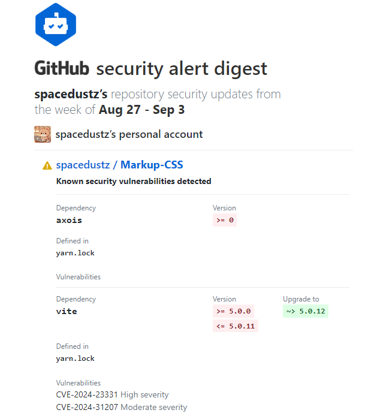
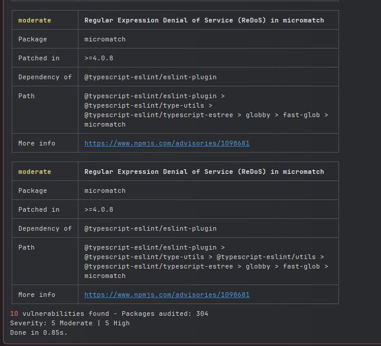
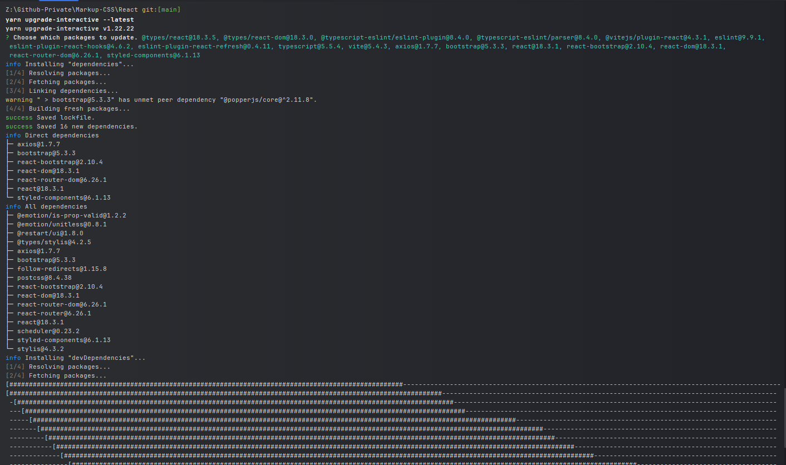
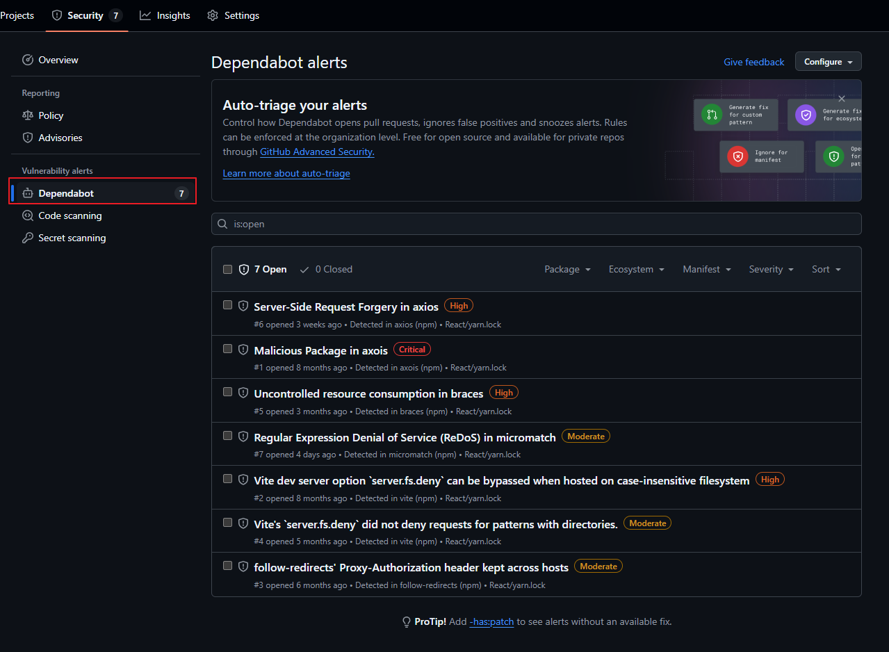
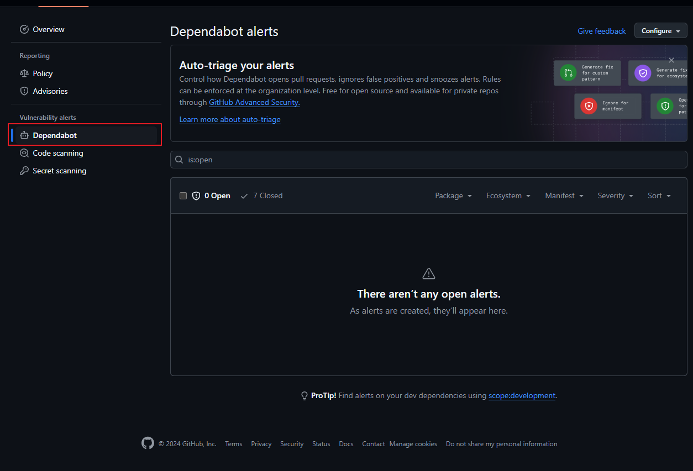

## Github - 보안 취약점 알림(Dependabot Security Alert) 해결

메일로 내 Github의 특정 Repository의 React 패키지에서 보안 취약점이 발견되었다는 메일이 자꾸 와서 메일을 안오게 하려고 알아보았습니다.



<br>

## 해결 방법

제 경우는 React 프로젝트를 `yarn`으로 생성했기 때문에 `yarn.lock` 파일이 있을 것이고, 만약 `npm`으로 했다면 `package-lock.json`이 있을겁니다.

이 두 경우에 해결방법이 다르므로 2가지 방법 다 작성 하겠습니다.

<br>

### 패키지 취약점 검사

```bash
# npm 인 경우
npm audit

# yarn 인 경우
yarn audit
```

명령어를 입력하면 아래 이미지 처럼 각 패키지의 취약점 개수와 내용이 나옵니다.



<br>

### 패키지 업데이트

`npm`의 경우 업데이트 가능한 패키지를 자동으로 업데이트 해주지만, `yarn`은 수동 업데이트를 해야 합니다.

수동이라고 하지만 `yarn upgrade-interactive --latest`를 입력 후 단순히 업데이트 할 패키지를 체크박스로 모두 선택 후 업데이트 해주면 됩니다.

```bash
# npm 인 경우
npm audit fix

# yarn 인 경우
yarn upgrade-interactive --latest
```



<br>

### Git Push

변경된 내용을 Repositoty Origin에 Push 하고 Repository의 Security 탭을 가보면 기존에 Security 탭에 떠있던 Security Issue들이 전부 Closed 되었습니다.



<br><br>


