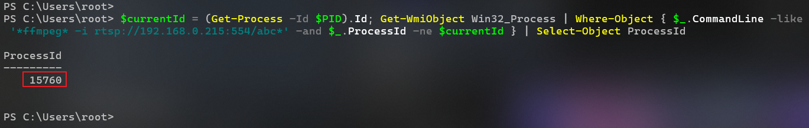

## Java에서 Windows Power Shell 명령어 실행

평소에 리눅스 환경의 서버에서 작업을 하다가 윈도우에 서버를 구축하고 Java 프로그램을 돌리던 중,

분석된 RTSP 영상을 HLS로 스트리밍 하는 로직에서 FFmpeg 프로세스가 실행이 안되어 알아 보았습니다.

<br>

Java 코드에서 OS 마다 실행할 Command를 Runtime의 getRuntime().exec()를 통해 실행합니다.

이 때 Linux와 Windows는 Shell환경이 다르니 당연히 OS에 맞는 Shell을 지정해줘야 제대로 동작 할 겁니다.

<br>

잘 동작하는지 테스트 하기 위해 그리고 **실시간 영상 변환 프로세스 체크 로직**에 Windows 관련 코드를 좀 추가 해주었습니다.

그리고 리눅스와 같은 환경을 만들어 테스트 해보겠습니다.

---

## 테스트

**RTSP Stream을 FFmpeg을 이용해 변환하는 프로세스 실행**


<br>

**변환중인 재생리스트(.m3u8)파일과 세그먼트(.ts)파일**


<br>

**실행중인 FFmpeg 프로세스 ID 확인 (Power Shell)**



<br>

**로직 추가 - Check FFmpeg Process**

리눅스에서는 잘 작동하던 로직이 윈도우에서 안된 문제이니, 윈도우 환경에서 테스트 진행

- 임의의 RTSP 영상을 FFmpeg을 이용해 변환 시킵니다.
- 변환중인 FFmpeg 프로세스의 ID를 출력하는 윈도우 명령어를 추가해주고, `exec()`에 `/bin/sh`를 빼주고 command 변수에 `powershell.exe`를 붙여 Shell을 지정 해 줍니다.
- 윈도우 프로세스의 InputStream, ErrorStream을 모두 출력 해줍니다.

```java
/**  
 * FFMPEG 프로세스가 실행 중인지 확인한다.  
 * * @param ip  
 * @param port  
 * @param instanceName  
 * @return  
 */  
public boolean isFfmpegProcessRunning(final String ip, final Integer port, final String instanceName) {  
    boolean isRunning = false;  
    String command = "";  
  
    if (OS.contains("win")) {  
        command = "powershell.exe $currentId = (Get-Process -Id $PID).Id; Get-WmiObject Win32_Process | Where-Object { $_.CommandLine -like '*ffmpeg -i rtsp://" + ip + ":" + port + "/" + instanceName + "*' -and $_.ProcessId -ne $currentId } | Select-Object ProcessId";  
        log.info("Check FFmpeg - OS : Windows");  
    } else {  
        command = "ps -ef | grep ffmpeg | grep rtsp://" + ip + ":" + port + "/" + instanceName + " | grep -v grep | awk '{print $2}'";  
        log.info("Check FFmpeg - OS : Linux");  
    }  
  
    log.info("Check FFmpeg - Command : {}", command);  
  
    Process process = null;  
  
    try {  
        if (OS.contains("win")) {  
            // 윈도우에서는 powershell 명령을 직접 실행  
            process = Runtime.getRuntime().exec(command);  
        } else {  
            // 리눅스에서는 /bin/sh를 통해 명령 실행  
            process = Runtime.getRuntime().exec(new String[]{"/bin/sh", "-c", command});  
        }  
  
        BufferedReader inputStream = new BufferedReader(new InputStreamReader(process.getInputStream()));  
        BufferedReader errorStream = new BufferedReader(new InputStreamReader(process.getErrorStream()));  
  
        String inputLine;  
        while ((inputLine = inputStream.readLine()) != null) {  
            log.info("Check FFmpeg - Input Stream - {}", inputLine);  
            isRunning = true;  
        }  
  
        String errorLine;  
        while ((errorLine = errorStream.readLine()) != null) {  
            log.info("Check FFmpeg - Error Stream - {}", errorLine);  
        }  
  
        process.waitFor(3000, TimeUnit.MILLISECONDS);  
  
    } catch (Exception e) {  
        log.warn("Check FFmpeg - Exception : {}", e.getMessage());  
        e.printStackTrace();  
    }  
  
    return isRunning;  
}
```

<br>

**Main 함수 실행 결과 프로세스가 실행 중임을 확인함과 동시에 Process ID까지 잘 출력 되어 isRunning값 True 반환**


<br>

**실제 로직 수정 후 찍힌 로그**

- **특정 카메라 번호에 대한 FFmpeg 프로세스 ID가 없으면** FFmpeg을 실행하는 Health Check 로직이 잘 실행 되었습니다.

