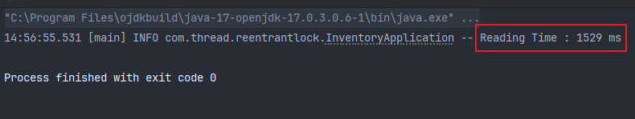
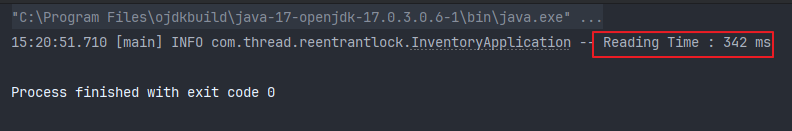

## ReentrantReadWriteLock

### 왜 사용해야 하는지?

주로 읽기 작업이 많은 어플리케이션에서

- 읽기 작업이 느릴때
- 읽기 작업에 드는 비용이 클 때
- 읽기 작업을 수행하는 Reader Thread가 여러개일때

<br>

**이런 상황이 왜 문제일까?**

읽기 작업을 수행하는 Thread가 여러개가 있고,

한 Thread가 공유 Resource를 읽을때 다른 Thread들은 Blocking 상태가 됩니다. 이때 앱의 읽기 성능애 문제가 생깁니다. (다른 Thread들은 대기상태 이기 때문)

위와 같은 상황을 ReentrantReadWriteLock을 사용하여, 읽기 작업을 수행하는 Thread들의 **공유 리소스 동시 접근**이 가능하게 하기 위한 클래스가 ReentrantReadWriteLock 입니다.

<br>

### 사용법

Thread 여러개가 있는 앱의 기능을 강화하려면 Read Lock과 Write Lock을 합친 ReentrantReadWriteLock을 활용해 어떻게 적용할 지 알아보겠습니다.

ReentrantReadWriteLock은 내부적으로 Read Lock, Write Lock 1쌍의 Lock을 가지고 있습니다.

Read Lock과 Write Lock은 서로 Lock을 점유중일때 Critical Section에 접근하는걸 막습니다.

<br>

또한, Reader Thread 여러개가 Read Lock이 보호하고 있는 임계 영역에 진입할 수 있게 하며,

Read Lock 내부에서 Thread를 몇개 보관하고 있는지 기록이 가능합니다.

---

## 구현

예시로 상품 가격을 Key, 상품 개수를 Value로 가지는 이진 탐색 트리의 한 형태의 레드블랙 트리 데이터베이스를 구현 하겠습니다.

처음은 Read/Write Lock과 차이점을 비교하기 위해 일반 ReentrantLock을 사용합니다.

<br>

### InventoryDatabase (Lock 적용 X, 기본 함수들 먼저 구현)

- getNumberOfItemInPriceRange : 하한가와 상한가를 파라미터로 받아 해당 범위 안의 있는 상품의 가격 합계를 반환
- add / remove Item : 아이템 추가, 제거

```java
@Slf4j
@Component
public class InventoryApplication {
    private static final int HIGHEST_PRICE = 1000;

    public static class InventoryDatabase {
        private TreeMap<Integer, Integer> inventory = new TreeMap<>();

        public int getNumberOfItemInPriceRange(int lowerBound, int upperBound) {
            Integer fromKey = inventory.ceilingKey(lowerBound); // 하한가와 같거나 큰 값중 가장 큰 키의 수 = 트리내의 최저가
            Integer toKey = inventory.floorKey(upperBound); // 상한가와 같거나 작은 값중 가장 큰 키의 수 = 트리내의 최고가

            if (fromKey == null && toKey == null) return 0;

            // 위에서 뽑은 상한가와 하한가를 NavigableMap에 새로 기록
            NavigableMap<Integer, Integer> rangeOfPrices = inventory.subMap(fromKey, true, toKey, true);

            // 위에서 새로 기록한 트리의 Value를 모두 더한 값
            int sum = 0;
            for (int numberOfItemForPrice : rangeOfPrices.values()) {
                sum += numberOfItemForPrice;
            }

            return sum;
        }

        public void addItem(int price) {
            inventory.merge(price, 1, Integer::sum);
        }

        public void removeItem(int price) {
            Integer numberOfItemsForPrice = inventory.get(price);

            if (numberOfItemsForPrice == null || numberOfItemsForPrice == 1) inventory.remove(price);
            else inventory.put(price, numberOfItemsForPrice - 1);
        }
    }
}
```

<br>

### InventoryDatabase (ReentrantLock 적용)

데이터베이스 클래스는 상품을 추가하거나 제거하는 작업(add / remove Item 함수)을 하는 Writer Thread 1개를 만들 예정이고,

상한가와 하한가에 범위에 해당하는 가격들의 합(getNumberOfItemInPriceRange 함수)을 구하는 Reader Thread들을 만들 겁니다.

이렇게 1개 Writer Thread와 여러개의 Reader Thread로 부터 공유 리소스인 Tree에 여러 요청이 올때 각 요청이 독립적으로 처리되도록 보호해야 합니다.

- 지금은 기본 `ReentrantLock` 사용
- 시간 측정 후 `ReentrantReadWriteLock`으로 변경 예정

```java
@Slf4j
@Component
public class InventoryApplication {
    public static class InventoryDatabase {
        private TreeMap<Integer, Integer> inventory = new TreeMap<>();
        private ReentrantLock lock = new ReentrantLock();

        public int getNumberOfItemInPriceRange(int lowerBound, int upperBound) {
            lock.lock();

            try {
                Integer fromKey = inventory.ceilingKey(lowerBound); // 하한가와 같거나 큰 값중 가장 큰 키의 수 = 트리내의 최저가
                Integer toKey = inventory.floorKey(upperBound); // 상한가와 같거나 작은 값중 가장 큰 키의 수 = 트리내의 최고가

                if (fromKey == null && toKey == null) return 0;

                // 위에서 뽑은 상한가와 하한가를 NavigableMap에 새로 기록
                NavigableMap<Integer, Integer> rangeOfPrices = inventory.subMap(fromKey, true, toKey, true);

                // 위에서 새로 기록한 트리의 Value를 모두 더한 값
                int sum = 0;
                for (int numberOfItemForPrice : rangeOfPrices.values()) {
                    sum += numberOfItemForPrice;
                }

                return sum;
            } finally {
                lock.unlock();
            }
        }

        public void addItem(int price) {
            lock.lock();

            try {
                inventory.merge(price, 1, Integer::sum);
            } finally {
                lock.unlock();
            }
        }

        public void removeItem(int price) {
            lock.lock();

            try {
                Integer numberOfItemsForPrice = inventory.get(price);

                if (numberOfItemsForPrice == null || numberOfItemsForPrice == 1) inventory.remove(price);
                else inventory.put(price, numberOfItemsForPrice - 1);

            } finally {
                lock.unlock();
            }
        }
    }
}
```

<br>

### main()

이제 위에서 Race Condition을 ReentrantLock을 이용해 막아줬고,

main 함수를 만들어서 랜덤한 Price 값을 이용해 Writer / Reader Thread를 만들어 시간을 측정하며 테스트 해보겠습니다.

Reader Thread는 실행 순서를 join()으로 제어해 각 스레드가 완료될 떄 마다 수행될 수 있게 합니다.

- InventoryDatabase 인스턴스 생성 후, 초기 데이터 셋업을 위해 10만 개의 아이템을 데이터베이스에 추가합니다.
- 1개의 Writer Daemon Thread (무한 루프 내에서 100000번 아이템을 랜덤하게 추가하고 제거하는 쓰기 작업 수행)
- 7개의 Reader Daemon Thread (시간 측정, 각 Reader Thread는 100000번의 주어진 가격 범위 내에 있는 아이템의 수를 계산하는 읽기 작업 수행)

```java
@Slf4j
@Component
public class InventoryApplication {
    private static final int HIGHEST_PRICE = 1000;
    
    // ... InventoryDatabase 클래스 (생략함)

    public static void main(String[] args) {
        InventoryDatabase db = new InventoryDatabase();
        Random random = new Random();

        // 실제 환경 벤치마크 테스트를 위해 내부 트리에 초기 키 넣기
        for (int i = 0; i < 100000; i++) {
            db.addItem(random.nextInt(HIGHEST_PRICE));
        }

        // 랜덤한 Price(키값)를 기준으로 아이템 추가/삭제 작업을 무한 반복하는 데몬 스레드
        Thread writer = new Thread(() -> {
            while (true) {
                db.addItem(random.nextInt(HIGHEST_PRICE));
                db.removeItem(random.nextInt(HIGHEST_PRICE));

                try {
                    Thread.sleep(10);
                } catch (InterruptedException e) {
                    log.warn("Writer Thread Sleep Interrupted : {}", e.getMessage());
                }
            }
        });

        writer.setDaemon(true);
        writer.start();

        // Reader Thread 7개 생성, 각 Reader는 10만번의 조회 실행
        int numberOfReaderThread = 7;
        List<Thread> readers = new ArrayList<>();

        for (int i = 0; i < numberOfReaderThread; i++) {
            Thread reader = new Thread(() -> {
                for (int j = 0; j < 100000; j++) {
                    int upperBoundPrice = random.nextInt(HIGHEST_PRICE);
                    int lowerBoundPrice = upperBoundPrice > 0 ? random.nextInt(upperBoundPrice) : 0;

                    db.getNumberOfItemInPriceRange(lowerBoundPrice, upperBoundPrice);
                }
            });

            reader.setDaemon(true);
            readers.add(reader);
        }

        long startReadingTime = System.currentTimeMillis();

        for (Thread reader : readers) {
            reader.start();
        }

        for (Thread reader : readers) {
            try {
                reader.join();
            } catch (InterruptedException e) {
                log.error("Reader Thread Join Interrupted : {}", e.getMessage());
            }
        }

        long endReadingTime = System.currentTimeMillis();
        log.info("Reading Time : {} ms", endReadingTime - startReadingTime);
    }
}
```

<br>

**실행 결과**

현재는 각 Reader Thread들이 Lock을 기다리며 Blocking 되어있다가 Lock을 얻은 후 순차적으로 실행되고 있으며,

실행 결과 모든 Reader Thread의 작업이 끝날 때까지 평균 1500ms 정도가 나오고 있습니다.



<br>

### InventoryDatabase (ReentrantReadWriteLock 적용)

위에서 ReentrantLock을 사용했을때 각 Reader Thread들이 동시에 실행되지 않고 1개의 Reader가 Lock을 잡고있을떄 Blocking 되었던 상황에서

ReadWriteLock을 사용해 읽기 성능을 향상시켜 보겠습니다.

- InventoryDatabase 클래스 내부 변수인 ReentrantLock을 ReentrantReadWriteLock으로 변경
- ReadLock, WriteRock 생성
- Read 작업을 하는 함수(getNumberOfItemPriceRange)에 readLock 사용
- Write 작업을 하는 함수(add/remove item)에 writeLock 사용

```java
@Slf4j
@Component
public class InventoryApplication {
    private static final int HIGHEST_PRICE = 1000;

    public static class InventoryDatabase {
        private TreeMap<Integer, Integer> inventory = new TreeMap<>();
        private ReentrantReadWriteLock lock = new ReentrantReadWriteLock();
        private Lock readLock = lock.readLock();
        private Lock writeLock = lock.writeLock();
//        private ReentrantLock lock = new ReentrantLock();

        public int getNumberOfItemInPriceRange(int lowerBound, int upperBound) {
            readLock.lock();

            try {
                Integer fromKey = inventory.ceilingKey(lowerBound); // 하한가와 같거나 큰 값중 가장 큰 키의 수 = 트리내의 최저가
                Integer toKey = inventory.floorKey(upperBound); // 상한가와 같거나 작은 값중 가장 큰 키의 수 = 트리내의 최고가

                if (fromKey == null && toKey == null) return 0;

                // 위에서 뽑은 상한가와 하한가를 NavigableMap에 새로 기록
                NavigableMap<Integer, Integer> rangeOfPrices = inventory.subMap(fromKey, true, toKey, true);

                // 위에서 새로 기록한 트리의 Value를 모두 더한 값
                int sum = 0;
                for (int numberOfItemForPrice : rangeOfPrices.values()) {
                    sum += numberOfItemForPrice;
                }

                return sum;
            } finally {
                readLock.unlock();
            }
        }

        public void addItem(int price) {
            writeLock.lock();

            try {
                inventory.merge(price, 1, Integer::sum);
            } finally {
                writeLock.unlock();
            }
        }

        public void removeItem(int price) {
            writeLock.lock();

            try {
                Integer numberOfItemsForPrice = inventory.get(price);

                if (numberOfItemsForPrice == null || numberOfItemsForPrice == 1) inventory.remove(price);
                else inventory.put(price, numberOfItemsForPrice - 1);

            } finally {
                writeLock.unlock();
            }
        }
    }

    public static void main(String[] args) {
        InventoryDatabase db = new InventoryDatabase();
        Random random = new Random();

        // 실제 환경 벤치마크 테스트를 위해 내부 트리에 초기 키 넣기
        for (int i = 0; i < 100000; i++) {
            db.addItem(random.nextInt(HIGHEST_PRICE));
        }

        // 랜덤한 Price(키값)를 기준으로 아이템 추가/삭제 작업을 무한 반복하는 데몬 스레드
        Thread writer = new Thread(() -> {
            while (true) {
                db.addItem(random.nextInt(HIGHEST_PRICE));
                db.removeItem(random.nextInt(HIGHEST_PRICE));

                try {
                    Thread.sleep(10);
                } catch (InterruptedException e) {
                    log.warn("Writer Thread Sleep Interrupted : {}", e.getMessage());
                }
            }
        });

        writer.setDaemon(true);
        writer.start();

        // Reader Thread 7개 생성, 각 Reader는 10만번의 조회 실행
        int numberOfReaderThread = 7;
        List<Thread> readers = new ArrayList<>();

        for (int i = 0; i < numberOfReaderThread; i++) {
            Thread reader = new Thread(() -> {
                for (int j = 0; j < 100000; j++) {
                    int upperBoundPrice = random.nextInt(HIGHEST_PRICE);
                    int lowerBoundPrice = upperBoundPrice > 0 ? random.nextInt(upperBoundPrice) : 0;

                    db.getNumberOfItemInPriceRange(lowerBoundPrice, upperBoundPrice);
                }
            });

            reader.setDaemon(true);
            readers.add(reader);
        }

        long startReadingTime = System.currentTimeMillis();

        for (Thread reader : readers) {
            reader.start();
        }

        for (Thread reader : readers) {
            try {
                reader.join();
            } catch (InterruptedException e) {
                log.error("Reader Thread Join Interrupted : {}", e.getMessage());
            }
        }

        long endReadingTime = System.currentTimeMillis();
        log.info("Reading Time : {} ms", endReadingTime - startReadingTime);
    }
}
```

<br>

**실행결과**

여러번 다시 실행해봐도 Thread끼리 경쟁(Race Condition)도 없으면서 수행 시간은 3배 이상 빨리진 것을 볼 수 있습니다.

왜냐하면 Reader Thread들이 공유 리소스에 동시에 다 접근이 가능하게 ReentrantReadWriteLock 에서의 ReadLock을 사용했기 때문입니다.

결론적으로 ReentrantReadWriteLock을 사용해 1500ms -> 300ms 수행시간의 변화를 보면 읽기 성능이 5배정도 향상 되었습니다.

