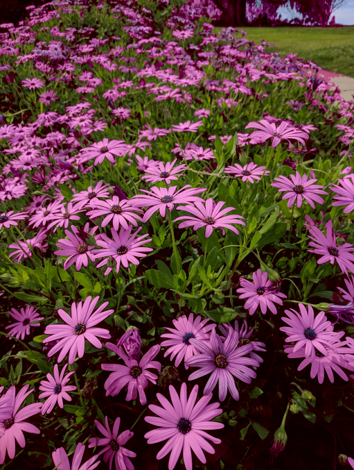

## 📘 Image Processing

어떤 사진에 1가지 종류의 꽃이 있고, 동일한 종의 꽃이지만 색깔은 2가지(흰색, 보라색)로 나뉘는 사진이 있습니다.

이 사진은 3036 x 4048이며 대략 1200만 픽셀로 이루어져 있고, 각 픽셀의 색깔은 **ARGB**로 불리는 4가지 Byte로 표현됩니다.

- **A (Alpha)** : 픽셀의 투명도 값을 나타냄
- **R (Red)** : 빨간색
- **G (Green)** : 초록색
- **B (Blue)** : 파란색

RGB의 조합으로 모든 색을 표현할 수 있습니다.

<br>

모든 꽃의 색깔을 보라색으로 만들기 위해 보라색으로 칠할 곳을 식별합니다.

- 색상 Re-Coloring 알고리즘을 Sequantial 버전으로 구현
- 구현을 모듈화해서 멀티스레드 작업으로 나누기

<br>


---
## 📘 **Single Threading**

ImageProcessing 클래스를 만들어 2가지 색깔을 가지는 1종류의 꽃을 하나의 색으로 통일시켜 보겠습니다.

클래스에서 사용한 함수의 설명부터 하고 코드를 적겠습니다.

<br>

> 📕 **getRed(), getGreen(), getBlue()**

**getBlue()**

- Alpha, Red, Green을 마스킹하며, 픽셀마다 비트마스크를 적용해서 컴포넌트를 전부 0으로 설정하고 **0x000000FF**를 적용합니다.

<br>

**getGreen()**

- Alpha, Red, Blue를 마스킹하며, Green 컴포넌트가 오른쪽에서 2번째 바이트니까 **0x0000FF00**를 적용하고 왼쪽으로 8비트 움직입니다.

<br>

**getRed()** 함수도 동일하게 만들어 줍니다.

<br>

이해가 어렵다면 아래 테이블을 봐주세요.

|A 25~32|R 17~24|G 9~16|B 1~8|
|---|---|---|---|
|0000 0000|0000 0000|0000 0000|0000 0000|

만약 getRed()라고 가정하면 R 부분을 제외한 나머지 비트들을 전부 & 연산 후, 16칸 >> 쉬프트 연산을 통해 R 값을 뽑아내는 겁니다.

<br>

> 📕 **createRGBFromColors()**

- RGB 개별 값을 합쳐서 픽셀에 RGB 값을 넣어주는 함수입니다.
- 각 비트 자리에 OR 연산을 통해 파라미터로 들어온 rgb 값을 대입한 후 리턴합니다.

<br>

> 📕 **isShadeOfGray()**

- 파라미터로 들어온 RGB 색상 값이 회색 음영인지 여부를 판단하는 함수입니다.
- RGB 색상 값의 빨강, 초록, 파랑 성분 간의 차이를 계산하고, 이 차이가 일정 범위 내에 있는 경우에만 해당 색상을 회색으로 간주합니다.
- 각 성분 간 차이 값을 임의로 30으로 설정 하였습니다.
- 만약 조건문이 전부 만족된다면, 해당 RGB 색상은 회색 음영으로 간주하고 **true**를 반환합니다.
- 간단히 말하면 RGB 각 색상이 비슷하면 회색으로 간주하는 로직입니다.

<br>

> 📕 **recolorPixel()**

- 원본 이미지의 RGB를 추출해 새로운 이미지에 색상을 입힐 함수입니다.
- 기존 이미지의 RGB값을 가지고 회색 계열인지 검증 후, 회색이라면 특정 색상의 값들을 올리거나 내립니다..
- 이 때, 바이트에 저장될 수 있는 최대값(255)를 넘지 않도록 Math.min()을 이용해 255로 제한해 줍니다.
- 그리고 "-"를 할때는 음수가 되지 않도록 Math.max()를 이용해 최대값을 0으로 잡아줍니다.
- 조건문의 else 부분은 만약 회색계열이 아니라면 오래된 픽셀을 제거하고 색상 값을 다시 할당합니다.

**😯 각 값들의 + - 수치를 정한 기준 😯**

- 보라색은 Red, Blue의 조합입니다.
- 그럼 Green은 확 낯추고 보라색은 Red에 더 가깝기 때문에 Red값을 올리고 Blue를 낯추었습니다.

<br>

> 📕 **setRGB()**

- recolorPixel() 함수로 새로운 이미지에 색상을 재설정하고 타깃(BufferedImage 객체, 픽셀 좌표, RGB 값)에 RGB를 할당합니다.

<br>

> 📕 **recolorImage()**

- 원본과 결과 이미지, 좌측과 상단의 코너 값, 이미지 너비와 높이를 파라미터로 받습니다.
- 첫번째 For Loop는 좌측 코너와 행의 끝 사이의 모든 X 값을 Loop 합니다.
- 두번쨰 For Loop는 Loop를 도는 모든 x값의 상단/하단의 모든 y값을 반복합니다.
- 그리고 모든 x,y 값에 recolorPixel() 함수를 호출합니다.

<br>

> 📕 **recolorSingleThread()**

- 전체 이미지에 대해 recolorImage()를 호출해 이미지를 단일 스레드로 색칠합니다.

<br>

> 📕 **main()**

- 메인 함수에서는 이미지 파일 처리를 위해 **BufferedImage** 클래스를 사용합니다.
- **BufferedImage** 클래스는 픽셀, 컬러스페이스, 디멘션 등 이미지 데이터 표현 & 픽셀 조작을 위한 다양한 함수를 제공합니다.

```java
public class ImageProcessing {  
    public static final String SOURCE_IMG = "img/Flowers.png";  
    public static final String DESTINATION_IMG = "Thread/src/main/resources/img/Purple-Flowers.png";  
  
    public static void main(String[] args) throws IOException {  
        Resource originalResource = new ClassPathResource(SOURCE_IMG);  
        BufferedImage originalImage = ImageIO.read((originalResource.getFile()));  
        BufferedImage resultImage = new BufferedImage(  
                originalImage.getWidth(),  
                originalImage.getHeight(),  
                BufferedImage.TYPE_INT_RGB // Color Space  
        );  
  
        recolorSingleThread(originalImage, resultImage);  
  
        File outputResult = new File(DESTINATION_IMG); // 파일 생성  
        outputResult.getParentFile().mkdirs();  
        ImageIO.write(resultImage, "png", outputResult); // 파일 Write    
      }  
  
    /* 원본, 결과 이미지 픽셀의 x,y 좌표를 표현하는 BufferedImage 객체를 가짐 */    
    public static void recolorPixel(BufferedImage original, BufferedImage result, int x, int y) {  
        int originalRGB = original.getRGB(x, y);  
  
        int red = getRed(originalRGB);  
        int green = getGreen(originalRGB);  
        int blue = getBlue(originalRGB);  
  
        int newRed, newGreen, newBlue;  
        /**  
         * 원본 이미지의 RGB가 회색 계열이라면 색상들의 값을 올리거나 내려줌  
         * 이때, 음수가 되지 않도록 Math.max(), 255를 넘어가지 않도록 Math.min()을 이용해줌  
         */  
        if (isShadeOfGray(red, green, blue)) {  
            newRed = Math.min(255, red + 10);  
            newGreen = Math.max(0, green - 80);  
            newBlue = Math.max(0, blue - 20);  
        } else {  
            newRed = red;  
            newGreen = green;  
            newBlue = blue;  
        }  
  
        int resultRGB = createRGBFromColors(newRed, newGreen, newBlue);  
        setRGB(result, x, y, resultRGB);  
    }  
  
    /* BufferedImage에 rgb를 설정 */    
    public static void setRGB(BufferedImage image, int x, int y, int rgb) {  
        image.getRaster().setDataElements(x, y, image.getColorModel().getDataElements(rgb, null));  
    }  
  
    /* 지정된 영역 안의 모든 픽셀의 색상을 재설정 */    
    public static void recolorImage(BufferedImage original,  
                               BufferedImage result,  
                               int leftCorner,  
                               int topCorner,  
                               int width,  
                               int height) {  
        for (int x = leftCorner; x < leftCorner + width && x < original.getWidth(); x++) {  
            for (int y = topCorner; y < topCorner + height && y < original.getHeight(); y++) {  
                recolorPixel(original, result, x, y);  
            }  
        }  
    }  
  
    /* 전체 이미지에 대해 recolorImage()를 호출해 이미지를 단일 스레드로 색칠 */    
    public static void recolorSingleThread(BufferedImage original, BufferedImage result) {  
        recolorImage(original, result, 0, 0, original.getWidth(), original.getHeight());  
    }  
  
    /* ========== Utils ========== */  
  
    /* 픽셀의 특정 색상 값을 취하고 픽셀에 넣을 회색을 결정 */    
    /* 빨강, 초록, 파랑 성분 간의 차이를 절대값으로 계산하고, 각 차이가 30 이하인지 확인 */    
    public static boolean isShadeOfGray(int red, int green, int blue) {  
        return Math.abs(red - green) < 30 && Math.abs(red - blue) < 30 && Math.abs(green - blue) < 30;  
    }  
  
    /* RGB 개별 값을 합쳐서 픽셀에 RGB 값을 넣어주는 함수 */    
    public static int createRGBFromColors(int red, int green, int blue) {  
        int rgb = 0;  
  
        rgb |= 0xFF000000; // A  
        rgb |= red << 16; // R  
        rgb |= green << 8; // G  
        rgb |= blue; // B  
  
        return rgb;  
    }  
  
    /* 특정 색상을 추출하는 함수 */    
    public static int getRed(int rgb) {  
        return (rgb & 0x00FF0000) >> 16;  
    }  
  
    public static int getGreen(int rgb) {  
        return (rgb & 0x0000FF00) >> 8;  
    }  
  
    public static int getBlue(int rgb) {  
        return rgb & 0x000000FF;  
    }  
}
```

<br>



위 이미지 프로세싱 코드는 싱글 스레드 기반으로 진행하였습니다.

이제 멀티스레드 솔루션을 생각해서 멀티 스레딩으로 작업을 어떻게 분할할지 생각해보죠.

---

## 📘 Multi-Threading

위 코드에서 이미지를 분할하여 가진 스레드 수 만큼 이미지를 병렬 처리 해보겠습니다.

즉 스레드 개수에 따라 이미지를 나누고 모든 스레드의 작업이 끝나면 BufferedImage를 파일에 저장합니다.

<br>

> 📕 **ImageProcessing**

위 코드에서 함수 하나만 추가합니다.

스레드의 수에 따라 모든 스레드의 width는 원본 이미지의 width로 설정합니다.

반면 높이는 스레드의 개수에 따라 나눠야 하므로 **원본 이미지의 Height() / 스레드 수**로 나눠줍니다.

<br>

그리고, 모든 스레드는 싱글 스레드로 처리하는 것처럼 LeftCorner부터 처리합니다.

하지만 높이를 기준으로 이미지를 잘랐듯이 스레드의 TopCorner 부분도 다릅니다.

TopCorner는 **스레드에 맞게 변하는 threadMultiplier 변수 * 각 스레드의 높이** 입니다.

<br>

그리고, recolorImage() 함수를 다시 이용해서 색을 입혀주고 스레드 리스트에 스레드를 추가합니다.

그 후, 모든 스레드를 시작하고 모두 join() 해주면 끝입니다.

```java
public static void recolorMultiThread(BufferedImage original, BufferedImage result, int numberOfThreads) {
        List<Thread> threadList = new ArrayList<>();
        int width = original.getWidth();
        int height = original.getHeight() / numberOfThreads;

        for (int i = 0; i < numberOfThreads; i++) {
final int threadMultiplier = i;

        Thread thread = new Thread(() -> {
        int leftCorner = 0;
        int topCorner = height * threadMultiplier;

        recolorImage(original, result, leftCorner, topCorner, width, height);
        });

        threadList.add(thread);
        }

        for (Thread thread : threadList) {
        thread.start();
        }

        for (Thread thread : threadList) {
        try {
        thread.join();
        } catch (InterruptedException e) {
        log.error("Thread Interrupted");
        }
        }
        }
```

이제 싱글스레드, 멀티스레드 두 작업 시간을 비교해보겠습니다.

---

## 📘 작업 시간 비교

이미지 처리 작업의 시작 시간과 종료 시간을 캡쳐합니다.

<br>

> 📕 **싱글 스레드**

```java
public static void main(String[] args) throws IOException {
        Resource originalResource = new ClassPathResource(SOURCE_IMG);
        BufferedImage originalImage = ImageIO.read((originalResource.getFile()));
        BufferedImage resultImage = new BufferedImage(
        originalImage.getWidth(),
        originalImage.getHeight(),
        BufferedImage.TYPE_INT_RGB // Color Space  
        );

        long startTime = System.currentTimeMillis();

        recolorSingleThread(originalImage, resultImage);

        long endTime = System.currentTimeMillis();

        long duration = endTime - startTime;

        File outputResult = new File(DESTINATION_IMG); // 파일 생성  
        outputResult.getParentFile().mkdirs();
        ImageIO.write(resultImage, "png", outputResult); // 파일 Write  
        log.info("총 작업에 걸린 시간 : {}", duration);
        }
```

<br>

**걸린 시간**

```
> Task :ImageProcessing.main()
23:40:20.221 [main] INFO com.thread.image.ImageProcessing -- 총 작업에 걸린 시간 : 610
```

<br>

> 📕 **멀티 스레드**

스레드를 2개, 3개 두 번 돌려봤습니다. 스레드를 1개씩 추가할 떄마다 걸린 시간이 줄어듭니다.

```java
public static void main(String[] args) throws IOException {
        Resource originalResource = new ClassPathResource(SOURCE_IMG);
        BufferedImage originalImage = ImageIO.read((originalResource.getFile()));
        BufferedImage resultImage = new BufferedImage(
        originalImage.getWidth(),
        originalImage.getHeight(),
        BufferedImage.TYPE_INT_RGB // Color Space  
        );

        long startTime = System.currentTimeMillis();

        recolorMultiThread(originalImage, resultImage, 3);

        long endTime = System.currentTimeMillis();

        long duration = endTime - startTime;

        File outputResult = new File(DESTINATION_IMG); // 파일 생성  
        outputResult.getParentFile().mkdirs();
        ImageIO.write(resultImage, "png", outputResult); // 파일 Write  
        log.info("총 작업에 걸린 시간 : {}", duration);
        }
```

**걸린 시간**

```
> Task :ImageProcessing.main()
23:42:31.405 [main] INFO com.thread.image.ImageProcessing -- 총 작업에 걸린 시간 : 429

> Task :ImageProcessing.main()
23:42:50.606 [main] INFO com.thread.image.ImageProcessing -- 총 작업에 걸린 시간 : 333
```

<br>

> 📕 **성능**

결론적으로만 보면 성능이 크게 향상되고 지연 시간이 줄어들었습니다.

이 후에도 물리적인 쿼드코어 개수에 맞게 스레드를 변경하면서 많이 실행해 봤는데,

물리적은 코어 수에 가까워질수록 지연시간이 줄어들었습니다.

<br>

하지만, 하이퍼스레딩 된 가상 코어 개수에 맞게 스레드수를 늘리기 시작하니 성능 향상이 줄고 중간쯤 부터는 오히려 역효과가 났습니다.

왜냐하면 하이퍼스레딩 된 가상코어는 원래의 물리코어의 리소스를 공유하기 때문입니다.

스레드의 수를 가상코어보다도 더 늘리면 성능적으로 어떠한 이점도 없음도 확인 하였습니다.

<br>

> 📕 **원본 이미지의 크기 변동**

원본 이미지의 해상도를 낯추고 스레드를 동일하게 늘리면 어떨까요?

기존 해상도로 멀티스레딩을 돌린결과 성능이 70%정도 좋아졌었습니다.

하지만 해상도가 낮아지니 **(처리할 수 있는 픽셀의 수가 떨어짐)** 멀티스레딩 처리를 함으로 인한 이점이 더 적어졌습니다.

<br>

759x1012 픽셀보다 더 작은 해상도의 이미지에서는 오히려 멀티스레딩이 Sequantial 방식보다 더 느려집니다.

느려지는 이유는 컨텍스트 스위칭이나 오버헤드가 늘어났지만 처리해야 할 원본 이미지의 픽셀수는 낮아졌기 떄문입니다.

<br>

> 📕 **결론**

- 큰 작업을 멀티스레드로 실행하면 속도와 성능을 크게 개선할 수 있다.
- 스레드가 코어보다 많이 생성되면 Blocking 호출이 없고 단순히 계산만 하는 문제에 대해선 역효과를 낳는다.
- 멀티스레드 구현에는 그만한 비용이 드므로 분할 효과를 보려면 작업이 커야 한다. (오버헤드, 스위칭 비용)