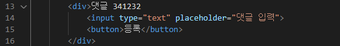
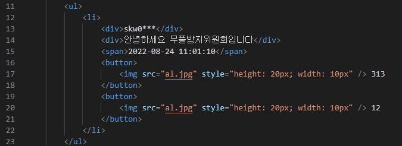
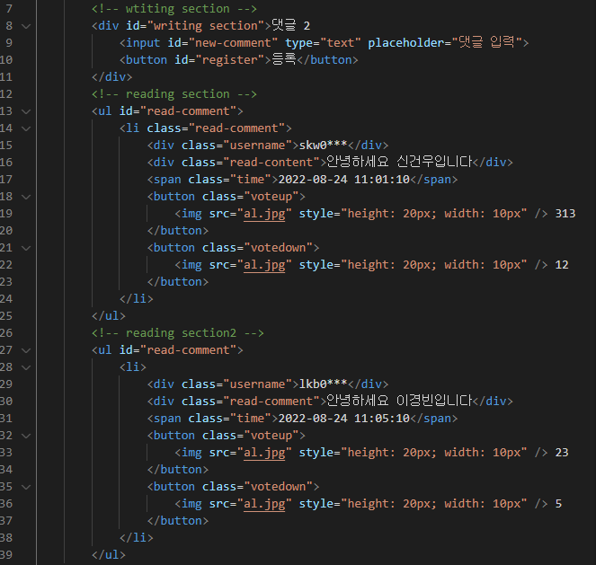
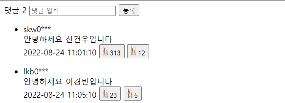

## 많이쓰는 HTML태그 정리! 📚

`<div>` : 영역을 나누는데 쓰임

`<p>` : 문단을 나누는데 쓰임 (div태그와 거의 비슷한 용도이나 단지 밑에 공간이 좀더 생김)

`` : 이미지 넣는데 쓰임. 단일태그임

`<input>` : 검색창처럼 사용자에게 입력을 받는 태그 단일태그임

`<button>` : 버튼을 만듬

`<a>` : 링크를 연결해서 여러페이지로 이동할수있음

<br>

> head 태그 안에 있던 태그들 정리 🚀

`<meta>` : 웹서버와 웹브라우저 사이에 주고받는 정보를 정의하는데 사용됨 문서 자체의 특성을 나타냄

`<title>` : 웹사이트가 열리면 상단에 생기는 tab에 이름을 나타냄

`<link>` : 필요한 스타일이나 아이콘등 외부 문서를 html문서에 연결시키는데 사용됨

---

## 기본적인 CSS 정리! 📚

`color` : 텍스트의 색을 바꿈

`background-color` : 배경색을 바꿈

`border` : 테두리를 그려줌, 3개의 인자를 받음 (두께, 스타일, 색깔)

`width / height` : 넓이와 높이를 지정하는데 쓰임

`text-align` : 정렬 (left, center, right)

`margin` : 내 영역 밖에 공간을 줌 (top, left, right, bottom)

`padding` : 내 영역 안에서 공간을 줌 (top, left, right, bottom)

---

## HTML태그에 스타일을주는 방법 🔗

<br>

### 1. HTML 태그에 직접주는 방법
- 어떤 태그에 공통적인 스타일을 주고싶을 때 사용하는 방법

```css
   div {
         color:red;
   }
```

<br>

### 2. id 를 이용해 주는방법
- class 와 사용방식이 비슷하지만 한번에 하나의 스타일만 줄수있음, 주로 자바스크립트에서 많이 쓰이고 스타일링에는 많이 안쓰이는 방식

```css
#new-style {
color:red;
}
```

```html
<div id="new-style">
```

<br>

### 3. class를 이용해 주는 방법 (강의에서 사용된 방법)
- 한번에 여러개의스타일을 줄수있다. 제일 많이 쓰이는 방법

```css
.new-style {
color:red;
}
```

```html
<div class="new-style">
```

<br>

### 4. 복합 선택자
- **일치 선택자** : 두가지 조건을 동시에 만족하는 요소 선택

```css
div.new-style {
      /*div태그에 new-style클래스
}
```

<br>

**자식 선택자**
```css
div>.new-style {
/* div의 자식요소중 class="new-style"선택
}
```

**후손 선택자**
```css
div .new-style {
/* div 후손요소들 중에서 class="new-style"
}
```

---

## WireFrame

> 🚩 **WireFrame이란?

웹 or 앱의 인터페이스를 시각적으로 묘사한것, 어떤 목적을 가진 프로그램인지 알 수 있게 설계하는것이 중요함.

<br>

> 🚩 **Mock-up**

**웹 or 앱 에서의 목업은 기능적으로는 동작하지 않지만, 실제 제품이 작동하는 모습과 동일하게 HTML,CSS 작성하는것**

<br>

> 🚩 **HTML로 웹 앱 구조잡기**

**1. 큰틀에서 영역 나누기**

- r , w 영역 나누기
- 태그별로 영역 나누기

<br>

**댓글 입력창**



<br>

**댓글창**



<br>

**위에서 간단하게만 태그별로 영역을 나눴는데 id와 class를 이용해서 목적에 맞게 사용**

목적에 맞는 id & class를 영역별로 나뉜 태그에 지정



<br>

이후 CSS 파일에서 각 태그 id & class에 대한 style을 지정 해주면 됨

