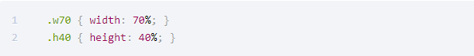
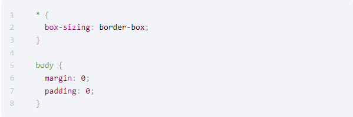
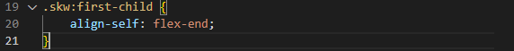

## 📘 Flex Box

**https://flexboxfroggy.com/#ko <- Practice Flexbox**

<br>

> 🚩 **레이아웃 구성**

- 수직분할 : 화면을 수직으로 구분하여, 콘텐츠가 가로로 배치될 수 있도록 요소를 배치
- 수평분할 : 분할된 각각의 요소를 수평으로 구분하여, 내부 콘텐츠가 세로로 배치될 수 있도록 요소 배치
- CSS로 화면을 구분할때에는 수직분할과 수평분할을 차례로 적용함.

<br>

**VS Code의 기본 레이아웃을 HTML 형식으로 작성한 예시**


<br>

HTML에서 class 로 지정된 요소를 CSS로 구현



<br>

클래스이름:구현 을 1:1로 일치시키는 기법을 [Atomic CSS 방법론](https://www.sitepoint.com/css-architecture-block-element-modifier-bem-atomic-css/) 이라고함.

<br>

> 🚩 **레이아웃 리셋**

문서의 시작점을 정확히 (0,0) 으로 시작하고 싶은데,

HTML의 기본 문서 스타일이 다르게 설정되있을 경우

<br>

기본 HTML 스타일을 제거하는 CSS 코드 예시



------
## 📘 FlexBox로 레이아웃 잡기

<br>

> 🚩 **Flexbox를 사용 하는 이유**

Flexbox는 모던 웹을 위하여 제안된 CSS3의 새로운 layout 방식이다.

요소의 사이즈가 불명확하거나 동적으로 변화할 때에도 유연한 레이아웃을 실현할 수 있다.

복잡한 레이아웃이라도 적은 코드로 보다 간단하게 표현할 수 있다.

<br>

> 🚩 **Flexbox 기본 개념**

Flexbox를 설명하는 가장 기본적인 개념은**Flex-container(부모)/Flex-item(자식)에서부터 시작한다.**

Flexbox의 **중요한 특징**은 아이템 각각에다가 명령을 하는 것이 아니라, **부모**한테 명령하는 것이다.


flex-container(부모)에게 display:flex를 선언하게 되면 flex-items은 즉각적으로 영향을 받고 실행된다.

하지만 여기서 유의해야할 건, Flex-container와 flex-items가 **직접적으로 종속관계**에 있어야 Flex모드가 제대로 적용된다.

초보단계에서 가장 많이 하는 실수중에 하나가 바로 이 부분.

<br>

> 🚩 **display:flex 분석**

부모 박스에 적용하여 자식박스의 방향과 크기를 결정하는 레이아웃 구성 방법 예시

우선 HTML로 3개의 div요소를 가진 main 작성


<br>

각 요소들이 잘 보이도록 main에 빨간색 점선, div에 초록색 실선으로 테두리를 설정하고 전체적으로 margin과 padding을 10px씩 할당


<br>

결과값. div 요소는 따로 설정을 안해주면 위쪽에서부터 세로로 정렬되며, 가로로 넓은 공간을 차지함


<br>

main에 display: flex 를 추가해보자


<br>

display를 적용했더니 div 요소들이 왼쪽부터 가로로 정렬된 것과 내용만큼의 공간을 차지하는것을 알 수 있음


<br>

> 🚩 **Parent 요소에 적용해야하는 Flexbox 속성들**

**주의점**

- 속성을 지정해주는 위치를 주의해야함
- Flexbox 속성중 부모요소,자식요소에 적용해야 하는 속성들이 있음.
- 위치가 맞지 않으면 요소들이 원하는대로 정렬이 되지 않음.

<br>

Axis (축): Main-axis(기준축) / Corss-axis(교차축)
Default flex-direction(Main-asis) = row

<br>

**flex-direction: row-reverse**
기준축이 가로 정렬, 교차축이 세로정렬이되 아이템의 정렬순서가 뒤바뀐다.
flex-start와 flex-end의 방향도 반대로 돌려진다.

<br>

**flex-direction: column-reverse**
기준축이 세로 정렬, 교차축이 가로정렬이되 아이템의 정렬 순서가 뒤바뀐다.
마찬가지로 flex-start와 flex-end의 방향도 반대로 돌려진다.

<br>

flex-direction을 row-reverse로 설정했을때


<br>

정렬 기준축이 반대방향으로 바뀐걸 볼 수 있다


**justify-content : 기준축의 정렬관리 (default: item을 수평정렬)**

**align-items : 교차축의 정렬관리 (default: item을 수직정렬)**

<br>

**Flexbox에서 가장 많이 사용되는 정렬방식 중 하나는 요소들을 일정한 간격을 두고 양 끝 배치하는것임**

justify-content: space-between 설정


<br>

일정한 간격을 두고 정렬되는것을 볼 수 있다


<br>

**그렇다면 flex-direction 을 column으로 변경해도 똑같이 적용이 될까?**

flex-direction을 column으로 설정한 모습


<br>

축 방향은 전환이 되었지만 양 끝으로 배치되지는 않았다. 그 이유는 정렬이 될만큼 충분한 사이즈의 세로값 입력이 없었기 때문


<br>

Flex를 선언한 부모태그에 세로값을 적용 시켜보자. (height= 50vh)


부모태그에 height를 설정해주니 정상적으로 justify-content:space-between 항목이 적용이 된 모습


<br>

> 🚩 **align-self**

align-self는 flexbox에서 몇 안되게 존재하는 독특한 개념인데 flex-container에게 옵션을 주는게 아니라

아이템에게 직접 옵션을 준다는 특징이 있다.

<br>

**align-self**는 align이 의미하듯이 교차축에 대한 정렬을 다루는데,

**각각의 아이템에 대한 정렬을 조절**할 수 있다.

<br>

HTML 파일에서 class를 skw로 지정하고 CSS에서 first-child 에게만 align-self를 적용시켜봤다



<br>

first-child 인 box1만 align-self: flex-end 의 적용을 받은 모습


<br>

> 🚩 **flex-wrap (줄바꿈 설정)**

- 하위요소의 크기가 상위요소의 크기를 넘으면 자동 줄 바꿈을 할 것인지 설정.
- 설정해주지 않으면 줄바꿈 X

<br>

상위요소인 main에 작성하여 하위요소인 div의 줄바꿈 설정


<br>

> 🚩 **Flex 속성의 값**

default 값 = flex: 0 1 auto;

flex: <grow(팽창 지수)> <shrink(수축 지수)> <basis(기본크기)>

값은 1개씩 따로 설정도 가능

<br>

grow = 총합 비율로 공간을 차지

shrink = grow와 같이 사용 X 권장

basis = grow의 속성이 0일떄 basis 크기를 지정할때만 크기 유지


\* 실제로 1:1:1 의너비를 갖는 flex-basis 사례를 구글링 해보자

------

## 📘 정리

1. **flexbox는 기준축을 중심으로 아이템을 정렬하는 방식이다.**
2. **기준축(row/column)에 따라,** **justify-content와 align-items의 정렬방식이 결정된다.**
3. **정렬을 할 수 있는 충분한 가로값, 세로값을 flex-container(부모태그)에 줘야지만 실제로 정렬이 일어남.**

<br>

**flex-direction: row** [가로축 정렬]
**justify-content**: 가로정렬의 세부적인 정렬 지정
**align-items**: 세로정렬의 세부적인 정렬 내용 지정
(center, space-between!, space-around, flex-start, flex-end)

<br>

> 🚩 **flex-direction**


<br>

> 🚩 **justify-content**


<br>

> 🚩 **flex-wrap**


<br>

**flex-direction이 row 일경우**

- justity-content(가로) / align-items(세로)

<br>

**flex-direction이 column 일경우**

- justity-content(세로) / align-items(가로)
- align-content

<br>

**order(item의 순서 결정)**

- 1 0 1 2 3 4 ~


**flex-wrap**

- nowrap,wrap,wrap-reverse

<br>

**flex-flow = flex-direction / flex-wrap 을 합쳐놓은 명령**

- ex) flex-flow: row wrap;

---

## 📘 그 외 다양한 팁

<br>

> 🚩 **단위 정리**

- **px** : 절대값, 다른값에 영향을 받지 않음
- **em** : 상위요소의 Font 크기를 기준으로 함. 상위 요소의 Font가 12px이면 1em은 12px이다. (반응형)
- **rem** : em과 비슷하지만 항상 root(html)의 Font를 기준으로 한다.
- **%** : 상위 요소 크기 기준 %

---

> 🚩 **@media query**

- 다른 프로그래밍 언어의 if문과 비슷하다.
- @media () <- 괄호 안에 특정 조건을 만족했을때 적용할 css 코드 작성

```tsx
const Input = styled.input`
    margin-top: 20px;
    width: 561px;
    height: 44px;
    border-radius: 24px;
    border: 1px solid #dfe1e5;
    padding-left: 60px;
    padding-right: 60px;
    
    @media (max-width: 768px) {
        width: 70%;
        padding-left: 20px;
        padding-right: 20px;
    }
`;
const SearchIcon = styled.img`
    position: relative;
    left: 40px;
    color: #9aa0a6;
    
    @media (max-width: 768px) {
        margin-left: 10px;
    }
`;

const Microphone = styled.img`
    position: relative;
    right: 40px;
    color: #9aa0a6;

    @media (max-width: 768px) {
        margin-right: 10px;
    }
`;
```
---

> 🚩 **margin: 1px 2px 3px 4px 의미**

- 시계방향 기준 12, 3, 6, 9시 방향으로 픽셀 확장

---

>  **CSS 우선순위**

어느게 우선순위가 제일 높을까


<br>

우선순위 규칙에 따라 id가 우선순위가 제일 높다


---