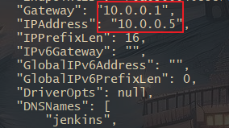
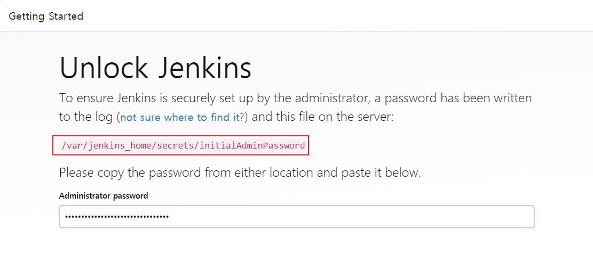
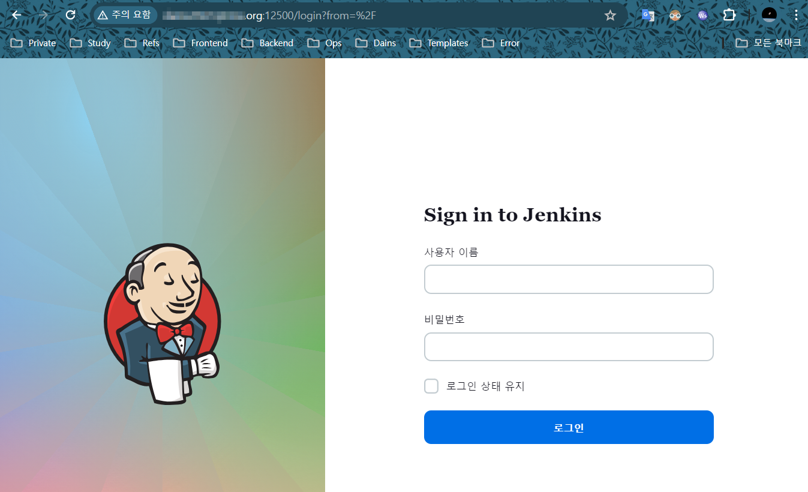
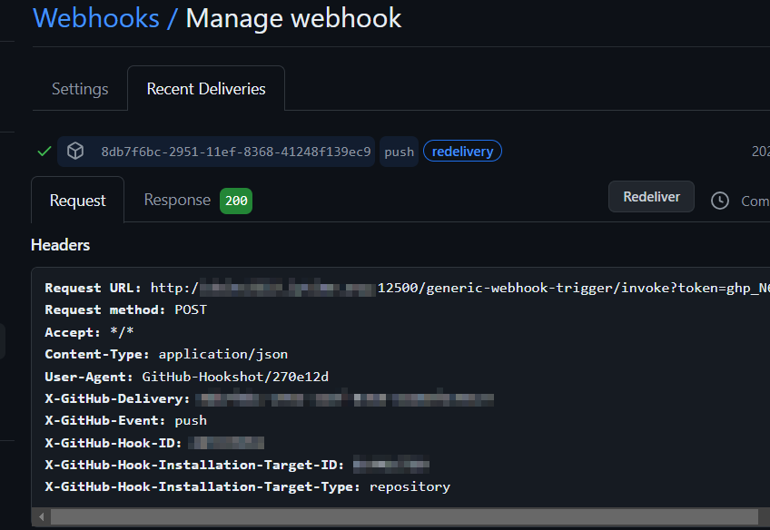
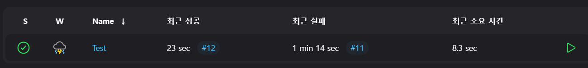

## Jenkins CI & CD + Nginx Reverse Proxy

예전에 Declaretive Pipeline 방식의 Blue/Green 무중단 배포와 FreeStyle 방식으로 구현을 했었고

그 이후로 아예 안써서 거의 잊어버렸는데, 최근 다시 쓸일이 생겨 재 포스팅합니다.

<br>

Nginx와 Docker를 이용해 Jenkins CI & CD를 구현하며, Jenkins는 Docker Container로 진행하고 

Ubuntu Server에 Docker가 설치된 상태라고 가정하고 글을 작성합니다.

---
### Docker Custom Bridge 생성

기본적으로 Docker의 기본 네트워크인 bridge0은 Container가 중지되고 재실행 될 때마다 IP가 유동적으로 바뀝니다.

그래서 저는 도커 네트워크를(Custom Bridge) 만들어 Container의 IP를 고정시켜서 변경되지 않게 합니다.

즉, 새로운 Docker Bridge를 만들고 컨테이너들을 기본 bridge0이 아닌 Custom Bridge에 할당시킵니다.

```bash
docker network create --gateway 10.0.0.1 --subnet 10.0.0.0/16 deploy
```

이 후, docker run을 할 때 --network deploy 옵션과 --ip 172.20.0.X 로 아이피를 할당하면 됩니다.

---
### Jenkins Container 실행

우선 Jenkins Container를 받아주고 위에서 만든 Private Docker Network에 넣어주고 IP는 5번을 할당합니다.

그리고, Jenkins Container 내부에 Git, OpenJDK를 설치하고 환경변수를 잡아줍니다.

```bash
# 8080 : Jenkins Management Port
# 50000 : Jenkins Agent Port
docker run -d --name jenkins --restart=on-failure -p 9000:8080 -p 50000:50000 -v /home/skw/jenkins:/var/jenkins_home --network deploy --ip=10.0.0.5 jenkins/jenkins:lts

# Jenkins 컨테이너 내부에 Git 설치


# Jenkins 컨테이너 내부에 JDK 설치
docker exec -it -u root jenkins /bin/bash
apt-get -y update
apt -y install openjdk-17-jdk

echo "JAVA_HOME=/usr/lib/jvm/java-17-openjdk-amd64" >> /etc/environment
source /etc/environment

# 추후 Jenkins JDK 설정을 위해 경로 알아두기
echo $JAVA_HOME
```

<br>

아래 이미지처럼 Container를 Inspect 한 결과 지정한 IP인 10.0.0.5가 할당되었습니다.



<br>

그리고, 실행된 컨테이너 내부에 초기 비밀번호 파일을 확인해서 로그인할 떄 사용해줍니다.

- `docker logs jenkins`를 입력하면 아래와 같이 초기 패스워드를 볼 수 있습니다.
- 이 초기패스워드로 로그인 후, Install Suggested Plugins을 클릭해 기본 플러그인들을 설치해줍니다.

```bash
docker logs jenkins
```

```
Jenkins initial setup is required. An admin user has been created and a password generated.
Please use the following password to proceed to installation:

6a65cf76fg7f4f16a6sc99cd4a110b0d

This may also be found at: /var/jenkins_home/secrets/initialAdminPassword
```



<br>

> **Jenkins 비밀번호 분실 시**

```bash
$ docker exec -it -u root jenkins /bin/bash
$ sudo vi /var/lib/jenkins/config.xml   # 파일 편집 진입
```

<br>

`<useSecurity> true </useSecurity>` 부분을 false로 하고 컨테이너 재시작

```bash
$ docker restart jenkins
```

웹 접속을 다시 하면 비밀번호가 초기화 되고 docker logs jenkins로 다시 확인 후 접속

---
## Git & JDK & Gradle Settings

**Git Settings (Jenkins Container 내부에 Git 경로)**

- Jenkins 관리 Global Tool Configuration 진입
- Git Path에 /usr/bin/git 등록 (보통 Git 경로가 여기에 있음)

<br>

**JDK Settings**

- Jenkins 관리  Global Tool Configuration 진입
- 컨테이너 내부에서 `echo $JAVA_HOME`
- 확인 후 경로를 Jenkins의 JAVA_HOME에 입력

<br>

**Gradle Settings**

- Jenkins 관리  Global Tool Configuration 진입
- Add Gradle 버튼 클릭
- name: 알아볼 수 있게 알아서
- Install automatically 체크 -> 사용중인 Gradle 버전 선택

---
### SSH Key 생성 & 등록 (in Container)

Jenkins Container 내부로 들어가서 SSH Key를 생성하고 CI & CD를 구축할 Github 계정에 등록해줍니다.

- Github 계정 설정 - SSH and GPG Key에 Public Key 등록

```bash
docker exec -it jenkins /bin/bash
cd && mkdir .ssh && cd .ssh && ssh-keygen -t rsa

cat id_rsa_pub # 키값 복사하기
```

---
### Jenkins Credentials 등록

> **Jenkins Global Credential 추가**

- Jenkins 관리 - Credentials 진입
- global 탭 옆 드롭다운 화살표 클릭해서 Add Credentials 클릭
- **Kind**는 Username with Password로 설정
- username : Github 닉네임
- password : 위에서 생성한 Github의 Jenkins Token 삽입
- ID, Description : 임의의 식별 ID 값을 넣어줌 (ex: Github-Access-Token)

<br>

> **Docker Hub Credential 추가**

Docker Hub Token을 등록해줘야 Jenkins를 통해 Docker Push 시 Docker Hub 로그인 과정에서 권한에러가 안뜬다.

먼저 Docker Hub Token을 발급한다.
- Docker Hub 로그인
- Account Settings
- Security
- New Access Tokens
- Access Token Description (원하는 이름으로 입력)
- Generate
- Token 복사 (창이 닫히면 다시 확인이 불가능 하므로 따로 저장해두자.)

<br>

다시 Jenkins 관리로 돌아와서
- Credentials 진입
- Add Credentials 선택
- `Kind` : username with password
- `Username` : Docker Hub 아이디 입력
- `Password` : Docker Hub 토큰 입력
- `ID` : 빈칸으로 냅두자
- Create 눌러서 등록

<br>

> **Github Credential 추가**

Jenkins 관리 -> Security -> Credentials 진입
- (global) 드랍박스 옆에 Add Credentials 클릭
- Github 계정 정보 입력
- `kind` : SSH Username with Private Key 선택
- `id` : 젠킨스에서 식별하는 고유값으로 입력하지 않아도 됨
- `username` : 깃허브 닉네임
- private key 밑에 Enter directly 체크
- Jenkins Container 내부에 생성해둔 SSH Private Key 값 넣어줌

---
### Nginx Reverse Proxy 설정

Github WebHook을 설정하기 전, Jenkins가 내부망 환경이기 떄문에 Nginx Reverse Proxy를 이용하고,Nginx도 Docker Container로 만들어 줍니다.

```bash
docker run -d --name nginx-reverse-proxy --restart=on-failure -p 10000:80 nginx:latest
```

제가 구성한 네트워크는 이렇습니다.

- Public 도메인:12500 -> 내부 서버:10000 포트포워딩
- 내부서버 10000 -> 내부망 서버의 Nginx Container의 80포트로 포트포워딩
- Nginx Container 안에서 내부망 서버의 9000 포트로 프록시
- 내부망 서버의 Jenkins 포트는 9000
- 즉, 도메인:12500으로 들어오면 내부망의 Nginx를 거쳐 프록시된 Jenkins에 접근할 수 있어야함

<br>

Nginx Container로 들어가 설정 파일을 편집하거나, 파일이 없다면 새로 생성해서 아래 내용을 넣어줍니다.

```bash
# Nginx Container 진입
docker exec -it nginx-reverse-proxy /bin/bash

# vi 편집기 설치
apt -y update
apt install -y vim

# Nginx Conf 파일 수정
vi /etc/nginx/conf.d/default.conf
```

```nginx
server {
    listen 80;
    server_name {포트포워딩 된 Public 도메인};

    location / {
        proxy_pass http://{Jenkins IP:포트};
        proxy_set_header Host $host:$server_port;
        proxy_set_header X-Real-IP $remote_addr;
        proxy_set_header X-Forwarded-For $proxy_add_x_forwarded_for;
        proxy_set_header X-Forwarded-Proto $scheme;
        proxy_connect_timeout 100s;
        proxy_read_timeout 90;
        
        # CORS 설정 추가
        add_header 'Access-Control-Allow-Origin' '*';
        add_header 'Access-Control-Allow-Methods' 'GET, POST, OPTIONS';
        add_header 'Access-Control-Allow-Headers' 'Origin, Content-Type, Accept, Authorization';
    }
}
```

```bash
# Nginx 설정 저장
nginx -s reload
```

<br>

리버스 프록시 설정이 다 되었다면, 도메인:12500으로 접속해보고 Jenkins 로그인 페이지가 나오는지 확인합니다.



---
### Github WebHook Trigger 연동

Jenkins에 아래 3개의 플러그인을 설치해줍니다.

- Generic Webhook Trigger 설치
- Github Integration Plugin 설치
- Github Plugin 설치

<br>

그리고 Github에서 Web Hook 설정을 해줍니다.

- Github 계정 - Settings - Developer Settings - Token 생성
- 토큰 권한 : `repo`, `admin`, `admin:repo_hook`
- 연결하고 싶은 Github Repository - Settings - Webhooks 진입 - Add Web Hook 클릭
- Payload URL 입력하고 Add Hook 클릭
  (Payload URL = `http://{jenkins-IP:Port}/github-webhook` 형식으로 지정)

Jenkins Generic Webhook Trigger에 사용법이 나와 있듯이 환경에 맞게 변경해서 사용하면 됩니다.

http://JENKINS_URL/generic-webhook-trigger/invoke 가 기본 payloadURL 이며, 아까 추가한 Hithub 토큰까지 추가해줘야 합니다.

http://JENKINS_URL/generic-webhook-trigger/invoke?token=test-token

`Content Type`은 application/json 으로 설정하고 Github Webhook 설정을 완료합니다.

<br>

다시 Jenkins 관리 - 시스템 설정 - Add Github Server 진입
- Name : 임의로 지정
- API URL : 그대로 두기
- Credentials 부분에 Add 클릭
- `kind` : Secret Text
- `Secret` : Github에서 발급한 토큰값 입력
- Add

만든 Credential 선택 - 오른쪽 Test Connection 클릭해서 연결 확인 - Apply 클릭

<br>

**Github Web Hook 연결 테스트**



---
###  Item 생성

Jenkins Version : **2.452.1**

Jenkins에서 실제 프로젝트를 등록합니다.

<br>

Jenkins 메인페이지 왼쪽 - 새로운 Item 클릭 - 프로젝트명 설정 - FreeStyle Project 선택 후 OK 클릭

그럼 Configure 화면이 나옵니다.

Configure 화면의 설정 항목들을 환경에 맞게 세팅합니다.
- General
- 소스 코드 관리
- 빌드 유발 (Generic Web Hook Trigger 사용)
- 빌드 환경
- Build Steps
- 빌드 후 조치

<br>

> **General 탭**

Github Project 선택 후 파이프라인을 구축할 Github Repository URL을 입력합니다.

ex: https://github.com/{username}/{repo-name}

<br>

> **소스코드 관리 탭**

Git 선택하고 위랑 동일한 URL + .git 을 붙여주고 브랜치 지정, Credential은 만들었던걸로 지정합니다.

ex: https://github.com/{username}/{repo-name}.git  or SSH URL

그리고, 소스코드 관리 부분에 등록된 Credentials 밑에 고급 부분을 열어서 Refspec 부분을 찾습니다.


`Refspec`에 사용할 브랜치들을 정의합니다.

**▶︎ branch 별 입력 예시**  
**feature**: `+refs/heads/feature/*:refs/remotes/origin/feature/*`  
**develop**: `+refs/heads/develop:refs/remotes/origin/develop`  
**release**: `+refs/heads/release/*:refs/remotes/origin/release/*`  
**master**: `+refs/heads/master:refs/remotes/origin/master`  
**all branch**: `+refs/heads/*:refs/remotes/origin/*`

<br>

만약 **특정 태그가 Push 될 때** 빌드를 하고 싶다면 RefSpec을 다음과 같이 작성 합니다.

`+refs/tags/*:refs/remotes/origin/tags/*`

<br>

tag명 중 abc란 단어가 들어간 경우만 빌드

`+refs/tags/abc*:refs/remotes/origin/tags/abc*`

<br>

`Branches to Build` 부분에서는 Build할 데이터를 가져올 브랜치를 설정합니다.

**▶︎ branch 별 입력 예시**  
**feature**: `*/feature/*`  
**develop**: `*/develop`  
**release**: `*/release/*`  
**master**: `*/master`

<br>

> **빌드 유발 탭**

Generic Webhook Trigger를 선택하면 여러개의 체크박스 선택지가 나옵니다.

그 중 `Post Content Parameters` 를 체크 해줍니다. 이 부분은 웹훅으로 오는 데이터를 변수화하기 위한 곳입니다.

Branch 정보가 담겨있는 ref 값을 지정하기 위해 **Variable**란 에 `ref` 를 입력 해줍니다.

**Expression**란 에는 `$.ref` 를 입력하고 JSONPath를 선택해주면 Post Content Parameters 부분은 끝입니다.

<br>

좀 내려와서 **Token** 부분을 찾고, Github Webhook 등록 시 token= 부분에 등록했던 토큰을 넣어줍니다.

이 Token은 Github Webhook Payload URL의 QueryString 으로 사용되며, Webhook의 Token으로 Jenkins Item과 Branch를 식별해서 Jenkins Build를 수행합니다.

<br>

좀 더 내려와서, **Optional Filter**부분의 Expression에 Webhook을 Trigger 할 Branch 표현식을 입력합니다.

**▶︎ branch 별 입력 예시**  
**feature**: `^(refs/heads/feature/.+)$`  
**develop**: `^(refs/heads/develop)`  
**release**: `^(refs/heads/release/.+)$`  
**master**: `^(refs/heads/master)`  
**develop|feature**: `^(refs/heads/develop|refs/heads/feature/.+)$`

Text 부분은 상단에서 정의하고 추출한 ref 값을 가져오기 위해 변수 호출을 합니다. ( $ref )

Extension과 Text 부분을 채워 넣었다면 아래 체크박스 중 **Github hook trigger for GITScm polling**을 체크해줍니다.

<br>

> **빌드 환경 탭**

**Delete workspace before build starts**를 체크해 빌드 전 기존 내용을 지워줍니다.

Use Secret text(s) or file(s) 선택

Binding 부분에서 `Username and Password (separated)` 방식 선택

전에 발급한 Docker Hub Token이 여기서 필요합니다. (도커 이미지 Push 시 권한 문제 방지)

Username Variable에 사용할 `변수명` 지정 (변수명이므로 실제 아이디를 쓰지 않도록 주의)

Password Variable에 사용할 `변수명` 지정 (변수명이므로 실제 비밀번호를 쓰지 않도록 주의)

그 후 Credentials에 등록해둔 Docker Hub Credentials를 선택합니다.

<br>

> **Build Steps 탭**

- **Add build step** 드롭다운 메뉴를 클릭해 **Invoke Gradle**을 선택합니다.
- Gradle Version을 선택합니다.
- **Tasks** 부분에 clean build 등 원하는 빌드 명령어를 적어줍니다.

---
### Push 해보기

아무거나 커밋 후 푸시 한다음, Jenkins에 들어가면 자동으로 Build가 되고 있는걸 볼 수 있습니다.



빌드 이후 작업인 Shell Script과 JenkinsFile, Docker File 등등은 예전에 썼던 글에서 크게 다르지 않으니 생략합니다.