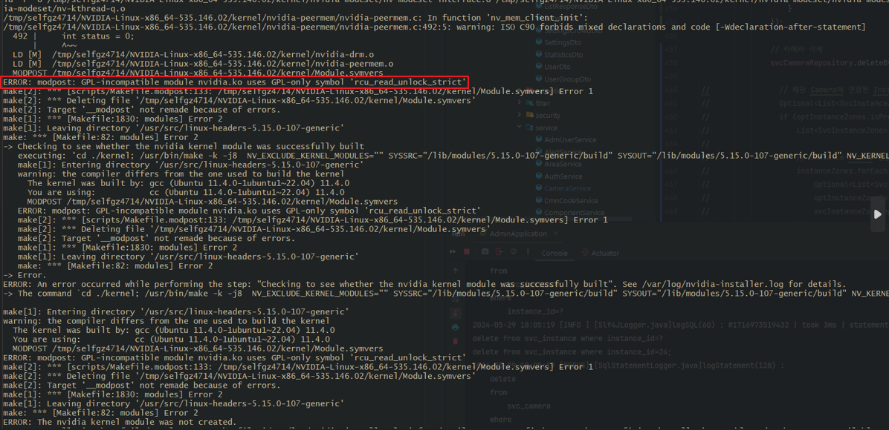
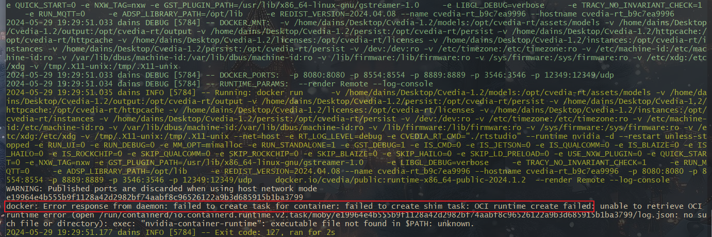
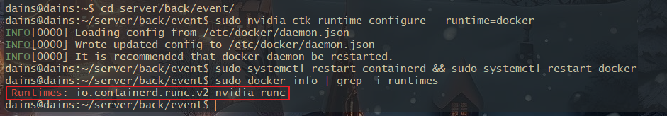

## NVIDIA-SMI GPL-incompatible module Error

서버에서 Docker Container로 GPU를 사용하는 딥러닝 프로세스를 실행중에 강제적인 시스템 종료 시,

NVIDIA Driver가 깨지는 현상이 있어서 해결한 기록을 포스팅합니다.

<br>

이번에 서버 재기동이 필요하여 실수로 GPU를 사용하는 Docker Container를 내리지 않고 서버를 종료를 한건지

Container 실행 시 NVIDIA Driver에 Crash가 났다는 에러가 떴습니다.

<br>

그래서 `dmesg | grep -i nvidia` 명령을 입력해 시스템 커널 로그와 NVIDIA 에러 로그를 보니 아래와 같이,

`nvidia.ko` 모듈이 GPL 전용 심볼을 사용하도록 되어 있었습니다.

이는 NVIDIA Driver와 커널의 특정 심볼이 호환되지 않아서 발생하는 에러입니다.



<br>

NVIDIA 내부 로직도 모르고 정확한 원인도 몰라서 일단 NVIDIA Driver를 깔끔하게 지워줍니다.

```bash
# NVIDIA 관련 파일 전부 제거
sudo apt -y remove --purge nvidia-*
sudo apt -y autoremove
```

<br>

그리고, 설치 가능한 Driver 리스트롤 보고 Recommanded Driver로 설치해도 되지만, 저는 특정 Cuda 버전을 사용하기 때문에,

Cuda Toolkit 버전에 호환되는 Driver를 설치하였습니다.

그리고, 서버 재기동 후 `nvidia-smi`를 입력하면 정상적으로 인식이 되는걸 볼 수 있습니다.

```bash
# Driver 조회
sudo ubuntu-drivers devices

# 최신 버전의 베타 그래픽 드라이버 PPA 저장소 추가
sudo addapt-repository ppa:graphic-drivers/ppa

# Driver 설치
sudo apt -y install nvidia-driver-{version}

# APT 업그레이드, 업데이트 후 재부팅
sudo apt -y update && sudo apt -y upgrade && sudo reboot
```

<br>

여기서 끝나면 좋았겠지만 저는 Docker Container에서 GPU 작업을 수행하는데, Container Runtime으로 NVIDIA를 사용하고 있었습니다.

위에서 NVIDIA 관련 모든 파일을 purge 했을떄 NVIDIA Container Toolkit까지 같이 삭제되었습니다.

그래서 Container를 실행했을 때, Docker의 Container Runtime이 NVIDIA로 맟춰져 있지 않아 Container 실행 시 에러가 떴습니다.



<br>

그러므로 다시 NVIDIA Container Toolkit을 설치해서 Docker의 Container Runtime을 NVIDIA로 변경해줍니다.

```bash
# Docker 런타임 엔진 확인
sudo docker info | grep -i runtimes
sudo apt-get -y update

# NVIDIA Container Toolkit 설치
sudo apt-get install -y nvidia-container-toolkit

# Nvidia Container Runtime Engine 변경
sudo nvidia-ctk runtime configure --runtime=docker

# Containerd & Docker 재기동
sudo systemctl restart containerd
sudo systemctl restart docker
```

<br>

그 후, 다시 Docker의  Runtime Engine을 확인해보면, NVIDIA로 잡혀있는걸 볼 수 있으며,

Docker Container가 Local의 NVIDIA GPU를 사용하도록 변경되었습니다.

