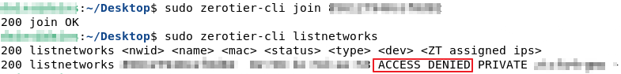
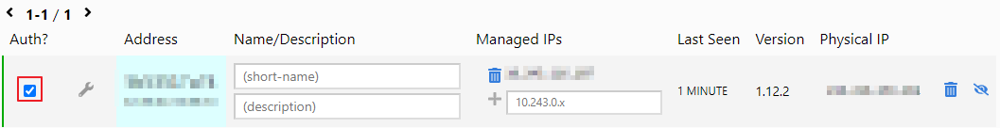
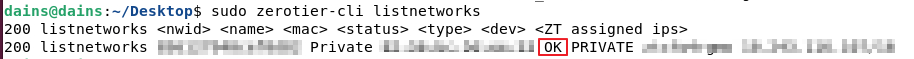

## Zerotier 설치 (Linux)

ZeroTier는 전 세계 어디에서나 개인 네트워크를 통해 장치를 연결하는 방법입니다. 

네트워크를 생성한 다음 _두 개 이상의 장치를_ 해당 네트워크에 연결하면 됩니다. 

ZeroTier를 사용하여 게임을 플레이하고 원격 비즈니스 리소스에 연결하거나 기업의 클라우드 백플레인으로 사용할 수도 있습니다.

<br>

> **설치**

- https://github.com/zerotier/ZeroTierOne
- https://docs.zerotier.com/

```bash
curl -s https://install.zerotier.com/ | sudo bash
```

---
## Network 생성

- https://my.zerotier.com <- 회원가입
- Create Network를 선택하면 네트워크가 생성됩니다.
- 생성된 네트워크의 Network ID를 이용합니다.

<br>

그 후 가입하려는 서버/컴퓨터 에서 Join 해줍니다.

```bash
sudo zerotier-cli info
sudo zerotier-cli join {Network-ID}
sudo zerotier-cli listnetworks
```

Join은 했지만 아직 네트워크 가입 허용을 안해서 ACCESS_DENIED가 나올것입니다.



<br>

가입 후, 위 사이트의 Members 탭에 Zerotier 네트워크 가입 신청이 와있는데 Auth 부분에 체크를 해주면 승인됩니다.



`zerotier-cli listnetworks`를 입력해보면 OK로 바뀌어 있고 네트워크 참가에 성공했습니다.



---
## Zerotier 명령어

```bash
# 네트워크 리스트
sudo zerotier-cli listnetworks

# 네트워크 Join
sudo zerotier-cli join ##########

# 네트워크 Leave
sudo zerotier0cli leave ##########

# 상태 확인
sudo zerotier-cli status
```