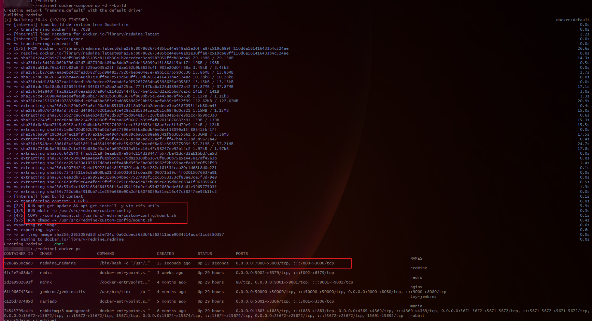
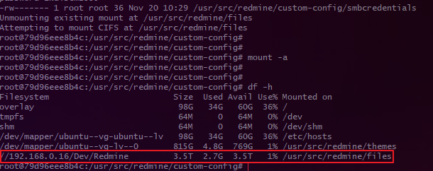

## Redmine <-> Synology NAS CIFS-Mount

프로젝트 관리 툴로 Redmine을 써보고자 Redmine을 설치 후 Redmine 에서 사용하는 데이터들은 NAS에 저장하고 싶어 연동했던 기록을 작성합니다.

현재 제 서버 환경은 별도의 서버에 Redmine을 NAS의 OS에 설치하는 것이 아닌 Docker-Compose로 올려뒀고, DB는 NAS 내부에 세팅 해두었습니다.

원래 DB도 별도의 서버에 했었지만, Redmine 내부 앱의 파일과 Redmine 개별 프로젝트에 올리는 "파일" 탭의 파일의 저장 위치가 달랐고,

1개는 앱 내부에서 DB로, 1개는 앱 외부에 특정 디렉터리로 저장이 되어 있었습니다.

<br>

그래서 앱 내부에 저장되는 파일(DB)은 NAS 내부에 DB를 설치하여 그곳에 저장하게 해뒀고, 

앱 외부 파일(별도 서버)이 저장되는 디렉터리에 NAS의 디렉터리와 마운트 해주었습니다.  

---

## Mount Script 작성

Dockerfile에서 사용할 마운트 스크립트입니다.

컨테이너 실행 후 entrypoint로 mount.sh를 실행하게 해두었습니다.

SMB(CIFS-Utils)를 사용해 컨테이너 내부 디렉터리 <-> 로컬 시스템과 같은 망인 NAS의 `/Dev/Redmine디렉터리와 마운트 해줍니다.

마운트 전 **기본적인 파일시스템(ext4)**과의 마운트를 해제하고 다시 새로 마운트 해주는 방식을 사용하였습니다.

```bash
#!/bin/bash

MOUNT_POINT="/usr/src/redmine/files"
REMOTE_PATH="//192.168.0.16/Dev/Redmine"

# SMB Credentials
CREDENTIALS_FILE="/usr/src/redmine/custom-config/smbcredentials"

# SMB Credentials 생성
touch /usr/src/redmine/custom-config/smbcredentials
echo "username=skw" | tee /usr/src/redmine/custom-config/smbcredentials
echo "password=1234" | tee -a /usr/src/redmine/custom-config/smbcredentials

# 권한 설정 후 확인
chmod 600 /usr/src/redmine/custom-config/smbcredentials
ls -l /usr/src/redmine/custom-config/smbcredentials  # 권한 확인

# 기존 ext4 마운트 포인트 해제 & CIFS 마운트 여부 확인 및 실행
if grep -qs "$MOUNT_POINT" /proc/mounts; then
  echo "Unmounting existing mount at $MOUNT_POINT"
  umount "$MOUNT_POINT"
fi

echo "Attempting to mount CIFS at $MOUNT_POINT"
if ! mount -t cifs -o credentials=$CREDENTIALS_FILE "$REMOTE_PATH" "$MOUNT_POINT"; then
  echo "Failed to mount CIFS at $MOUNT_POINT"
fi

# docker-entrypoint.sh 실행
exec "$@"
```

---

## Dockerfile

Dockerfile을 작성하여 Docker-Compose에서 사용합니다.

컨테이너 내부엔 ruby on rails만 깔려있고 기본적인 패키지들이 안 깔려있기 떄문에 apt update와 vim, 마운트를 위한 cifs-utils를 설치해 줍니다.

그리고 기본 디렉터리에 custom-config를 만들어 여기에 마운트 스크립트를 저장 후 컨테이너가 실행되면 자동으로 NAS와 마운트 됩니다.

```dockerfile
FROM redmine:latest

# 추가 패키지 설치
RUN apt-get update && apt-get install -y vim cifs-utils

# /usr/src/redmine/custom-config 디렉토리 생성
RUN mkdir -p /usr/src/redmine/custom-config

# mount.sh 스크립트를 컨테이너에 복사
COPY ./config/mount.sh /usr/src/redmine/custom-config/mount.sh

# 실행 권한 부여
RUN chmod +x /usr/src/redmine/custom-config/mount.sh

# ENTRYPOINT 명시: mount.sh 실행 후 /docker-entrypoint.sh 실행
ENTRYPOINT ["/bin/bash", "-c", "/usr/src/redmine/custom-config/mount.sh && exec /docker-entrypoint.sh rails server -b 0.0.0.0"]
```

---

## Docker Compose 파일

간단하게 포트포워딩과 DB정보들을 env로 넣어 주었습니다.

하나 유의할 점은 `privileged` 옵션을 넣어주었는데, 이 옵션을 안넣으면 커널과 관련된 명령어인 `mount` 명령을 root 계정임에도 실행할 수 없기에 넣어 주었습니다.

그리고, 비교적 용량이 적은 플러그인과 테마 디렉토리만 서버 내에 저장하고 컨테이너 내부의 파일 디렉터리는 NAS와 마운트됩니다.


```yaml
version: '3.7'
services:
  redmine:
    build: .
    privileged: true
    container_name: redmine
    restart: always
    ports:
      - "7000:3000"
    environment:
      REDMINE_DB_MYSQL: 192.168.0.16
      REDMINE_DB_PORT: 7001
      REDMINE_DB_USERNAME: skw
      REDMINE_DB_PASSWORD: 1234
      REDMINE_DATABASE: redmine
      REDMINE_DB_ENCODING: utf8mb4
      TZ: Asia/Seoul
    volumes:
      - ./data/plugins:/usr/src/redmine/plugins
      - ./data/themes:/usr/src/redmine/themes
```

---

## 실행

Docker Compose를 실행 시키고 실행 로그를 보면 Dockerfile이 잘 실행되면서 mount.sh가 실행된 걸 볼 수 있습니다.

```bash
docker-compose up -d --build
```



<br>

마운트가 되어있는지 확인 해보면, 컨테이너 내부 파일 저장 디렉터리인 `/usr/src/redmine/files`와 NAS의 `/Dev/Redmine`과 마운트 되어있고,

Redmine 프로젝트 내부에서 파일업로드를 해보면 NAS에 잘 들어옵니다.

```bash
docker exec -it redmine bash

df -h
```

