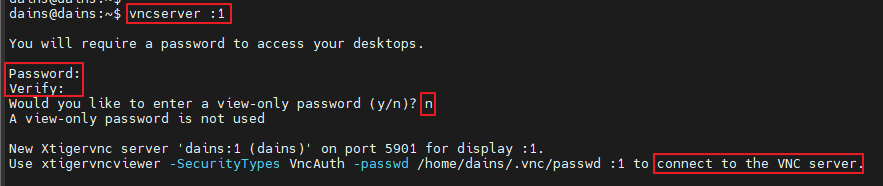
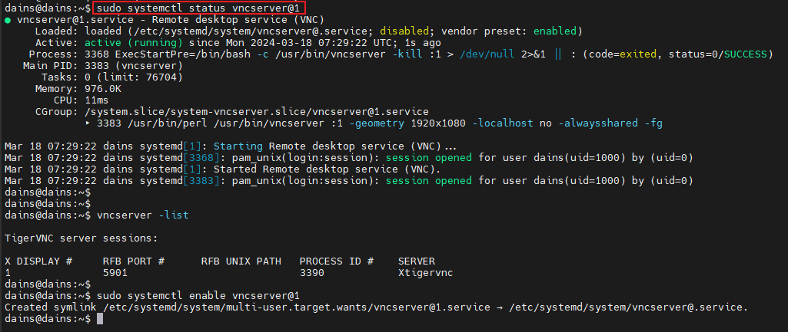
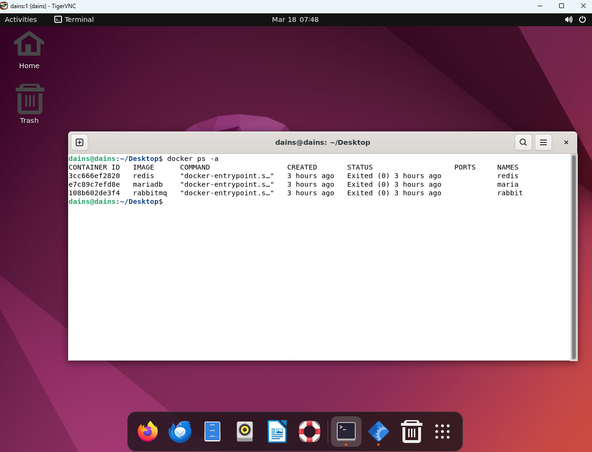
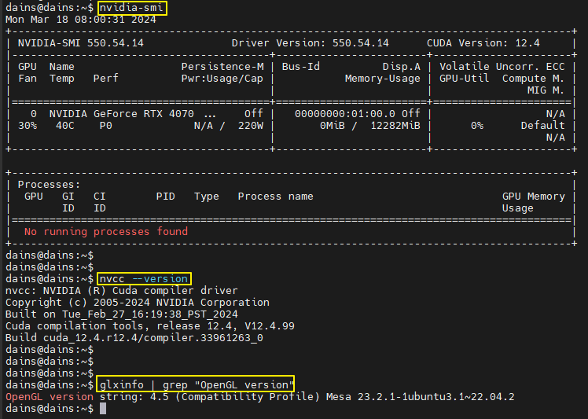

# Linux Graphic Driver & Remote GUI를 위한 TigerVNC 설정

**📌 사전 준비 사항**

- Ubuntu Server 22.0 LTS 버전 설치 (OS 설치중 파티션 분할 시, /swap 파티션은 메모리의 2배 용량으로 잡아 주기)
- 설치된 Ubuntn Server Home 디렉터리에 GPU에 맞는 Nvidia Graphic Driver(.run 파일) 두기

---

## ⚙️ 1. Nouveau Kernel Driver 시스템 블랙리스트 추가

- 이 커널은 Nvidia Driver 커널과 충돌이 일어나므로 시스템 블랙리스트 목록에 추가해서 충돌을 방지 해 줍니다.
- 설치 후 Reboot을 무조건 수행해야 하므로 이 스크립트를 먼저 실행 해 줍니다.

```bash
#!/bin/bash

sudo apt-get -y remove nvidia* && sudo apt -y autoremove
sudo apt install -y dkms build-essential linux-headers-generic pkg-config libglvnd-dev
sudo echo -e "blacklist nouveau\nblacklist lbm-nouveau\noptions nouveau modeset=0\nalias nouveau off\nalias lbm-nouveau off" | sudo tee -a /etc/modprobe.d/blacklist.conf
sudo update-initramfs -u
sudo reboot
```

---

## ⚙️ 2. 서버 기본 패키지 설치 & 그래픽 드라이버 잡기

- APT Update & Upgrade
- 유저 권한 설정
- OpenJDK 17 설치
- Yarn 설치
- NodeJS 설치
- Docker 설치
- RabbitMQ & MariaDB & Redis Container 생성
- FFmpeg 설치
- Nvidia Container Tool Kit
- Cuda Toolkit 설치

```bash
#!/bin/bash

# 스크립트를 실행 하기 전 필수 준비 사항
# /home/{user-name} 경로에 Graphic Driver(.run 파일)과 Cvedia tar.gz 파일이 존재해야 함


# -------------------- 변수 --------------------
NVIDIA_RUN_FILE=NVIDIA-Linux-x86_64-550.54.14.run # Graphic Driver 파일명
CUDA_TOOL_KIT_FILE=cuda_12.4.0_550.54.14_linux.run # Cuda Toolkit 파일명

# -------------------- 기본 개발 환경 & 실행 환경 설정 --------------------
## Update / Upgrade
sudo apt -y update && sudo apt -y upgrade

## 유저 sudo 권한 추가
sudo usermod -aG sudo dains

## OpenJDK 17 설치
sudo apt -y install openjdk-17-jdk

## Yarn 설치
curl -sL https://dl.yarnpkg.com/debian/pubkey.gpg | sudo apt-key add -
echo "deb https://dl.yarnpkg.com/debian/ stable main" | sudo tee /etc/apt/sources.list.d/yarn.list
sudo apt -y install yarn

## NodeJS 설치
sudo curl -fsSL https://deb.nodesource.com/setup_16.x | sudo -E bash -
sudo apt-get -y install nodejs
sudo npm install --global yarn
sudo npm install --global next

## Docker 설치
sudo apt-get -y install apt-transport-https ca-certificates curl gnupg-agent software-properties-common
curl -fsSL https://download.docker.com/linux/ubuntu/gpg | sudo apt-key add -
sudo add-apt-repository "deb [arch=amd64] https://download.docker.com/linux/ubuntu $(lsb_release -cs) stable"
sudo apt -y update
sudo apt-get -y install docker-ce docker-ce-cli containerd.io
sudo systemctl start docker && sudo systemctl enable docker

## FFmpeg 설치
sudo apt -y install ffmpeg

## RabbitMQ Container
# - 1883 : MQTT
# - 4369 : EPMD
# - 5671 : TLS
# - 5672 : AMQP
# - 15672 : Web Console
# - 15674 : RabbitMQ WebSocket
# - 25672 : RabbitMQ Clustering
# - Admin 계정 추가 및 권한 부여
sudo docker run -d --name rabbit -p 1883:1883 -p 4369:4369 -p 5671:5671 -p 5672:5672 -p 15672:15672 -p 15674:15674 -p 25672:25672 rabbitmq:3-management
sleep 2
sudo docker exec rabbit rabbitmq-plugins enable rabbitmq_mqtt
sleep 2
sudo docker exec rabbit rabbitmq-plugins enable rabbitmq_web_mqtt
sleep 2
sudo docker exec rabbit rabbitmq-plugins enable rabbitmq_web_stomp
sleep 2
sudo docker exec rabbit rabbitmqctl add_user admin admin
sleep 2
sudo docker exec rabbit rabbitmqctl set_user_tags admin administrator
sleep 2
sudo docker exec rabbit rabbitmqctl set_permissions -p / admin ".*" ".*" ".*"
sleep 2
sudo docker exec rabbit rabbitmqctl enable_feature_flag all
sleep 2
sudo docker restart rabbit

sudo usermod -aG docker dains # 도커 소켓 실행 권한 추가

## MariaDB Container
# 컨테이너를 생성하고 dains 계정과 dains 데이터베이스 생성 및 권한 부여
sudo docker run -d --name maria -e MARIADB_ROOT_PASSWORD=1234 -p 5001:3306 mariadb
sudo docker exec maria mariadb -u root -p1234 -e "\
create database dains character set utf8mb4 collate utf8mb4_general_ci; \
create user 'dains'@'%' identified by '1234'; \
grant all privileges on dains.* to 'dains'@'%'; \
flush privileges;"

## Redis Cotainer
sudo docker run -d --name redis -p 5002:6379 redis

# -------------------- Graphic Driver --------------------
sudo apt -y install build-essential pkg-config libglvnd-dev freeglut3-dev libglu1-mesa-dev mesa-common-dev mesa-utils unzip wget

## Graphic Driver 설치
sudo ./${NVIDIA_RUN_FILE}

## Nvidia Container-Toolkit 설치 & Production 저장소 구성
sudo curl -fsSL https://nvidia.github.io/libnvidia-container/gpgkey | sudo gpg --dearmor -o /usr/share/keyrings/nvidia-container-toolkit-keyring.gpg \
  && curl -s -L https://nvidia.github.io/libnvidia-container/stable/deb/nvidia-container-toolkit.list | \
    sed 's#deb https://#deb [signed-by=/usr/share/keyrings/nvidia-container-toolkit-keyring.gpg] https://#g' | \
    sudo tee /etc/apt/sources.list.d/nvidia-container-toolkit.list

## Nvidia Container Tool Kit 설치
sudo docker info | grep -i runtimes # 런타임 엔진 확인
sudo apt-get -y update
sudo apt-get install -y nvidia-container-toolkit

## Nvidia Container Runtime Engine 구성
sudo nvidia-ctk runtime configure --runtime=docker
sudo systemctl restart containerd
sudo systemctl restart docker

## Cuda Toolkit 설치 & 환경 변수 설정
sudo wget https://developer.download.nvidia.com/compute/cuda/12.4.0/local_installers/${CUDA_TOOL_KIT_FILE}
sudo chmod +x ${CUDA_TOOL_KIT_FILE}
sudo ./${CUDA_TOOL_KIT_FILE}
cat <<EOL >> ~/.bashrc
export PATH=/usr/local/cuda-12.4/bin:$PATH
export LD_LIBRARY_PATH=/usr/local/cuda-12.4/lib64:$LD_LIBRARY_PATH
EOL

source ~/.bashrc

## Ubuntu-GUI 설치
sudo apt -y install ubuntu-desktop
sudo reboot
```

---

## ⚙️ Remote GUI를 위한 Tiger VNC 설치

```bash
## TigerVNC & D-bus & Xorg 패키지 설치
sudo apt -y install tigervnc-standalone-server dbus-x11 pkg-config xserver-xorg-dev

## xorg.conf 파일명 변경
sudo mv /etc/X11/xorg.conf /etc/X11/xorg.conf.org

## xstartup 스크립트 생성
mkdir .vnc && cd .vnc && touch xstartup && cd

cat > /home/dains/.vnc/xstartup << 'EOF'
#!/bin/sh

unset SESSION_MANAGER
unset DBUS_SESSION_BUS_ADDRESS
[ -r $HOME/.Xresources ] && xrdb $HOME/.Xresources
vncconfig -iconic &
"$SHELL" -l << 'EOF2'
export XDG_SESSION_TYPE=x11
export GNOME_SHELL_SESSION_MODE=ubuntu
setxkbmap -layout us
dbus-launch --exit-with-session gnome-session --session=ubuntu
EOF2
EOF

sudo chmod 755 /home/dains/.vnc/xstartup

## DISPLAY 환경변수 등록
echo "export DISPLAY=:1" >> ~/.bashrc
source ~/.bashrc


## VNC Server Systemd 서비스 등록
sudo touch /etc/systemd/system/vncserver@.service
sudo chmod 777 /etc/systemd/system/vncserver@.service

cat > /etc/systemd/system/vncserver@.service << EOF
[Unit]
Description=Remote desktop service (VNC)
After=syslog.target network.target

[Service]
Type=simple
User=dains
PAMName=login
PIDFile=/home/%u/.vnc/%H%i.pid
ExecStartPre=/bin/bash -c '/usr/bin/vncserver -kill :%i > /dev/null 2>&1 || :'
ExecStart=/usr/bin/vncserver :%i -geometry 1920x1080 -localhost no -alwaysshared -fg
ExecStop=/usr/bin/vncserver -kill :%i

[Install]
WantedBy=multi-user.target
EOF

sudo systemctl daemon-reload

sudo reboot
```

<br>

> Reboot 후 실행 명령어

```bash
# VNC Server의 1번 Display를 On 시킴
vncserver :1

# VNC Server 1번 디스플레이 서비스 시작
sudo systemctl start vncserver@1
sudo systemctl enable vncserver@1

# 디스플레이 정상 온라인 확인
vncserver -list
```

<br>

**1번 디스플레이 On**

- `vncserver :1` 를 입력하여 1번 디스플레이 실행
- 비밀번호 설정
- View-Only 옵션 `N`을 입력하여 거부



<br>

**디스플레이 상태 확인**

- `vncserver -list`를 입력하여 디스플레이가 정상적으로 떠있는지 확인



---

## VNC Client 연결 - SSH Tunneling

서버에서 VNC Server를 설정했으니 클라이언트인 로컬에서 SSH 터널링을 해주고 VNC로 연결해줍니다.

```bash
ssh -L 5901:127.0.0.1:5901 -N -f -l {서버 계정명} {원격지IP}
```



<br>

**SSH 터널링 후 VNC Viewer에 `localhost:디스플레이 번호` 로 연결 후 Xhost 액세스를 허용**

```bash
xhost +Local:*
```

<br>

## Graphic Driver & Cuda Toolkit & OpenGL 정상 인식 확인

- `nvidia-smi` 명령으로 Nvidia Driver가 잘 잡혀있는지 확인
- `nvcc --version` 명령으로 Cuda Toolkit이 잘 잡혀있는지 확인
- `glxinfo | grep "OpenGL version` 명령으로 OpenGL이 잘 잡혀있는지 확인



---

## VNC 각종 오류 해결 방법

>  **만약 VNC 인스턴스를 종료했는데도 새 인스턴스 시작이 안된다면 적용 해볼 방법들 - VNC Server**

- `/tmp/.X11-unix` 경로 아래에 X1, X2 등등 임시파일 삭제
- `/tmp/.X2-lock` 하위에 파일들 삭제

<br>

> **VNC 클라이언트로 접속 시 로그인 세션이 잠길 때 - VNC Server**

- `~/.Xauthority` 파일 삭제 후 vnc 인스턴스 kill -> 재시작
- `loginctl unlock-sessions`

<br>

> **OpenGL Rendering 안될 때 - VNC Client**

- VNC Viewer로 연결한 서버의 터미널에서 아래 명령 실행
- `xhost +Local:*`