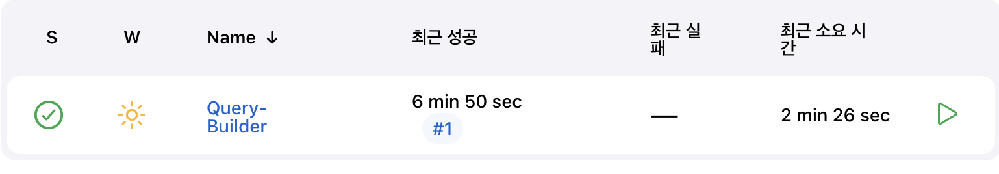
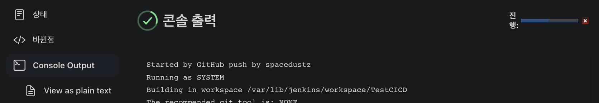
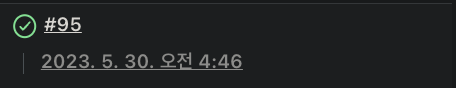
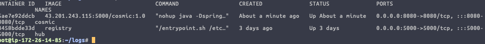
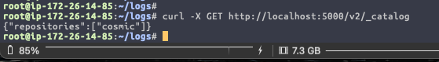

## Jenkins Declarative Pipeline 설정

**환경**
- Jenkins Version 2.407
- 분산 빌드 환경 사용 (Local = Agent, EC2 = Controller)
- 추후 빌드 속도에 따라 Local을 LightSail로 변경의 소지가 있습니다.

<br>

**목차**
- EC2 생성 + 환경 세팅 스크립트 작성
- Jenkins Credential 등록
  (SSH Key, Github Token, Docker Hub Token 생성 & 입력 & 등록)
- Jenkins Plugin 설치
- Local Jenkins Controller에서 노드 등록

---

## EC2 생성 + 환경 세팅 스크립트 작성

EC2를 생성하기 전, 보안그룹의 포트를 열고 허용할 IP대역을 추가해줍니다.

<br>

### 보안 그룹 생성

내 Local의 공인 IP를 확인하여 EC2 Instance에서 사용할 포트들에게 내 IP or 내 IP대역만 허용합니다.

ex: `123.123.123.123/32` or `123.123.123.0/24`

보안그룹 수정 후, Local에서 EC2로 접속이 되는지 접속해보고 잘 되면,

내 IP 대역이 아닌 환경에서 접속해서 접속이 안되는지 확인합니다. (보안그룹에서 허용한 대역 외에서는 접속이 되면 안됩니다)

<br>

그리고 Github Webhook을 쓸것이기 때문에 Github에서 제공하는 Github용 IP 대역들을 추가해줘야 합니다.

[Github API](https://api.github.meta)

위 링크에서 Webhook 부분의 IP들을 보안그룹에 다 넣어줍니다.

저는 Jenkins에 18080을 사용하기 때문에 18080 + 해당 IP대역들 총 6개의 포트를 추가해줬습니다.

이걸 추가 안해주면 Webhook 자체가 EC2로 못들어옵니다.

<br>

이제 EC2를 생성하면서 보안 그룹을 연결하고 생성된 인스턴스에 접속 해봅시다.

접속 하자마자 스크립트 파일을 만들어서 아래 내용을 넣어주고 실행합니다.

<br>

###  **스크립트 작성**

기본 패키지 + Docker + Jenkins 설치 + 설치 로그 파일 남기기

```bash
#!/bin/bash


# APT 업데이트
apt-get -y update
ate-get -y upgrade
echo ----- APT Update 종료 ---- | tee settinglogs

# Time Zone 설정
timedatectl set-timezone 'Asia/Seoul'

# 기본 패키지 설치
apt install -y firewalld net-tools curl wget gnupg lsb-release ca-certificates apt-transport-https software-properties-common gnupg-agent openjdk-11-jdk
echo ----- 기본 패키지 설치 완료 ----- >> settinglogs


# OpenJDK 전역변수 설정
echo export JAVA_HOME=/usr/lib/jvm/java-11-openjdk-amd64 >> ~/.bashrc
echo ----- $JAVA_HOME ----- >> settinglogs


# Firewalld 시작
systemctl start firewalld && systemctl enable firewalld
echo ----- Firewalld 시작 ----- >> settinglogs


# 포트 오픈
firewall-cmd --permanent --add-port=22/tcp
firewall-cmd --permanent --add-port=80/tcp
firewall-cmd --permanent --add-port=443/tcp
firewall-cmd --permanent --add-port=5000/tcp
firewall-cmd --permanent --add-port=8080/tcp
firewall-cmd --permanent --add-port=18080/tcp
firewall-cmd --permanent --add-service=http
firewall-cmd --permanent --add-service=https

# Jenkins < - > Github Webhook을 위한 IP 허용
firewall-cmd --permanent --add-rich-rule='rule family="ipv4" source address=192.30.252.0/22 port port="22" protocol="tcp" accept' && firewall-cmd --permanent --add-rich-rule='rule family="ipv4" source address=185.199.108.0/22 port port="22" protocol="tcp" accept' && firewall-cmd --permanent --add-rich-rule='rule family="ipv4" source address=140.82.112.0/20 port port="22" protocol="tcp" accept' && firewall-cmd --permanent --add-rich-rule='rule family="ipv4" source address=143.55.64.0/20 port port="22" protocol="tcp" accept' && firewall-cmd --permanent --add-rich-rule='rule family="ipv6" source address=2a0a:a440::/29 port port="22" protocol="tcp" accept' && firewall-cmd --permanent --add-rich-rule='rule family="ipv6" source address=2606:50c0::/32 port port="22" protocol="tcp" accept'


# Firewall Settings 저장
firewall-cmd --reload
echo ----- Firewalld 설정 완료 ----- >> settinglogs


# 도커 설치

## 도커 GPG Key 추가
mkdir -p /etc/apt/keyrings
curl -fsSL https://download.docker.com/linux/ubuntu/gpg | sudo apt-key add -

## 도커 저장소 설정
sudo add-apt-repository "deb [arch=amd64] https://download.docker.com/linux/ubuntu $(lsb_release -cs) stable"

## 도커 엔진 설치
apt install -y docker-ce docker-ce-cli containerd.io
echo ----- 도커 설치 완료 ----- >> settinglogs

## 도커 시작
systemctl start docker && systemctl enable docker
echo ----- 도커 시작 ----- >> settinglogs


# 젠킨스 설치
wget -q -O - https://pkg.jenkins.io/debian-stable/jenkins.io.key | sudo apt-key add -

curl -fsSL https://pkg.jenkins.io/debian-stable/jenkins.io-2023.key | sudo tee \
  /usr/share/keyrings/jenkins-keyring.asc > /dev/null

echo deb [signed-by=/usr/share/keyrings/jenkins-keyring.asc] \
  https://pkg.jenkins.io/debian-stable binary/ | sudo tee \
  /etc/apt/sources.list.d/jenkins.list > /dev/null

apt -y update

apt install -y jenkins
echo ----- Jenkins 설치 완료 ----- >> settinglogs

# 도커 권한 부여
usermod -aG docker jenkins

chmod 666 /var/run/docker.sock


# 젠킨스 포트 변경
sed -i 's/8080/18080/g' /usr/lib/systemd/system/jenkins.service

# Daemon Reload
systemctl daemon-reload

# 젠킨스 시작
systemctl start jenkins && systemctl enable jenkins
echo ----- Jenkins 시작 완료 ----- >> settinglogs
```

---

## SSH, Token 발급

**EC2 SSH + Github Token & Docker Token 발급**
- EC2 Instance의 .ssh 디렉터리로 이동해서 `ssh-keygen -t rsa`로 SSH키 쌍을 발급합니다.
- Github - Settings - SSH Key and GPG Key - SSH키 등록 - `위에서 발급한 SSH Public Key`를 등록합니다.
- Github - Developer Settings - Personal Access Key - Tokens - Generate new Token 클릭
  토큰의 권한은 `admin:repo_hook`,`admin:org`를 체크하고 발급한 후, 가지고 있습니다. ``
- Docker Hub 로그인 - Token 생성해서 일단 가지고 있습니다.

다 완료하면 가지고 있는 것들은
- Docker Token
- Github Token
- EC2 SSH Key

입니다.

---

## Jenkins Credential 등록

위에서 만든 SSH, Token으로 Jenkins에서 Credential을 등록합니다.

Jenkins Web - Jenkins 관리 - Credential로 이동합니다.

<br>

**Docker Token 등록**
- `Kind` : username with password
- `Username` : Docker Hub 닉네임 입력
- `Password` : Docker Hub 토큰 입력
- `ID` : 빈칸으로 냅두기
- Global 옆에 화살표를 눌러 Add Credentials 선택
- Create 눌러서 등록

<br>

**Github Account 등록**
- `kind` : SSH Username with Private Key 선택
- `id` : 젠킨스에서 식별하는 고유값으로 입력하지 않아도 됨
- `username` : 깃허브 닉네임
- (global) 드랍박스 옆에 Add Credentials 클릭
- Github 계정 정보 입력
- private key 밑에 Enter directly 체크
- Jenkins Server의 SSH Private Key 값 넣어줌

<br>

**Github Webhook을 위한 Github Token 등록**
- `kind` : Secret Text
- `Secret` : Github에서 발급한 토큰값 입력
- Name : 임의로 지정
- API URL : 그대로 두기
- Credentials 부분에 Add 클릭
- Add

---

## Jenkins JDK, Gradle 설정

Jenkins 관리 - Tools 로 진입합니다.

<br>

###  Gradle Settings
- Gradle Add
- name: 알아볼 수 있게 알아서
- Install automatically 체크 -> Gradle 7.2 선택
- Apply - Save

<br>

###  JDK Settings
- 컨테이너 내부에서 `echo $JAVA_HOME`
- 확인 후 경로를 Jenkins의 JAVA_HOME에 입력
- Apply - Save

---

## Jenkins Agent 등록

Agent에도 위 EC2 보안그룹에서 추가한 포트들을 열어줍니다.

제 경우는 macOS이기 때문에 포트를 열고 Java를 설치해 환경변수를 세팅하였습니다.

```bash
# macOS 포트 오픈 파일 임시 권한 상승
sudo chmod 777 /etc/pf.conf

# 포트 등록
vi /etc/pf.conf

pass in proto tcp from any to any port 18080
pass in proto tcp from any to any port 22
pass in proto tcp from any to any port 8080
pass in proto tcp from any to any port 443
pass in proto tcp from any to any port 50000
pass in proto tcp from any to any port 5000
pass in proto tcp from any to any port 4444
pass in proto tcp from any to any port 80

:wq

# 권한 다시 원래대로 되돌리기
sudo chmod 644 /etc/pf.conf

# 포트 적용 확인
sudo pfctl -vnf /etc/pf.conf

# JDK 전역 변수 등록
echo export JAVA_HOME=/opt/homebrew/Cellar/openjdk@11/11.0.19/libexec/openjdk.jdk/Contents/Home >> ~/.zshrc
```

<br>

이제 다시 Jenkins 관리 - Security - Agent 부분에 Fixed 선택 후 포트번호 50000을 추가 합니다.

그리고 Jenkins 관리 - 노드 관리 - 신규 노드 추가로 들어갑니다.

원하는 노드 이름을 입력하고, Type에서 permanent Agent를 체크하고 Create를 클릭합니다.

<br>

### Name과 & Description
자유롭게 작성합니다.

<br>

### Number of Executors

1 로 설정합니다.
- Jenkins의 Thread로 1번에 하나의 Job만 수행되게 설정했습니다.
- 이유는 Memory 이슈로 Instance가 종료될 수 있기 때문입니다.

<br>

### Remote root Derectory

**Agent Node에서** agent가 설치되고, workspace가 생성될 공간입니다. (jenkns_home)

- Agent(mac)의 최상위 디렉터리 - Documents 폴더 밑에 agent/backend 디렉터리를 만들어 주었습니다.
- 이 노드는 백엔드 프로젝트의 빌드를 담당할것이기 때문에 backend 디렉터리를 따로 만들었습니다.
- 그럼 경로는 /Documents/agent/backend로 설정합니다.

<br>

### Label

Jenkins에서 Job을 생성할 때 이 Label을 통해서 어떤 노드를 실행할 지 선택할 수 있습니다.

이 노드는 Backend 빌드용이니 Backend로 설정해주겠습니다.

<br>

### Launch Method

Jenkins가 Agent를 제어하는 방법을 선택할 수 있습니다.

- **Launch agent by connecting it to the controller** : Slave에서 직접 Agent를 실행시켜, Jenkins Controller와 연결하는 방법입니다 (Slave → Controller). Jenkins Controller에서 직접 Slave에 명령하지 못하는 상황에서 사용합니다. Agent가 준비될 때 마다 Controller와 연결될 수 있도록 준비합니다. 이때 TCP 50000번 포트가 사용됩니다.
- **Launch agent via execution of command on the controller** : 첫번째 방법과 반대로 Jenkins Controller가 Slave에 명령을 보내는 방식입니다. Jenkins Controller는 SSH를 사용해 agent에 접속하며, 미리 agent에 설치된 `agent.jar` 파일을 실행합니다.
- **Launch agents via SSH** : SSH 연결을 통해 명령을 전달시켜 agent를 등록합니다. Agent 노드에 별다른 설치가 필요 없습니다.

<br>

Jenkins Controller가 SSH 연결을 통해 Agent로 접근이 가능하므로,

마지막 방법인 Launch Agent via SSH로 선택하겠습니다.

<br>

SSH를 선택하면, 설정할 수 있는 폼이 나옵니다.

- Host : Agent Node의 IP를 입력합니다.

- Credentials : 위에서 등록한 Local SSH를 등록한 Credential을 사용합니다.

- Usage : Label이 일치하는 노드에서 해당 빌드작업을 수행할 수 있도록 Only build jobs with label expressions matching this node를 선택합니다.

- Host Key Verification Strategy : Manually trusted key Verification Strategy를 선택합니다.

<br>

고급 부분을 열어보면 더 다양한 옵션을 설정할 수 있습니다.

- Port : Controller와 Agent를 연결할 포트를 지정합니다. 기본 SSH 포트인 22로 설정합니다.

---

## Jenkins Generic Webhook Trigger

Jenkins의 플러그인을 통해 더 세부적인 Webhook Trigger를 설정 할 수 있습니다.

<br>

### Jenkins Plugin 설치
- Generic Webhook Trigger 설치
- Github Integration Plugin 설치
- Github Plugin 설치

---

## Github Webhook 연동

- Github 계정 - Settings - Developer Settings - Token 생성
- 토큰 권한 : `repo`, `admin`, `admin:repo_hook`
- 연결하고 싶은 Github Repository - Settings - Webhooks 진입
- Payload URL 입력하고 Add Hook 클릭
  (Payload URL = `http://{jenkins-IP:Port}/github-webhook` 형식으로 지정)

---

## Github Webhook 설정

`payload URL` 변경

Jenkins Generic Webhook Trigger에 사용법이 나와 있듯이 환경에 맞게 변경해서 사용하면 됩니다.

http://JENKINS_URL/generic-webhook-trigger/invoke 가 기본 payloadURL 이며,

아까 등록한 토큰 값까지 추가해줘야 합니다.

http://JENKINS_URL/generic-webhook-trigger/invoke?token=test-token

<br>

`Content Type`은 반드시 application/json 으로 설정하고 Github Webhook 설정을 완료합니다.

---

## Docker Container Registry 구축

Docker Hub에 프로젝트 내용을 올리면 안되니 Local에 이미지들을 저장합니다.

<br>

Docker Login

```bash
$ docker login -u [닉네임]
```

<br>

Docker Registry Base Image 가져오기

```bash
$ docker pull registry:latest
```

<br>

insecure 설정
아래 내용 전부 다 작성, Local-IP 부분엔 자신의 로컬머신 or 인스턴스 IP를 적는다

```bash
$ vi /etc/docker/daemon.json

{
    "exec-opts": ["native.cgroupdriver=systemd"],
    "log-driver": "json-file",
    "log-opts": {"max-size": "100m"},
    "storage-driver":"overlay2",
    "insecure-registries":["Local-IP:5000"]
}

:wq
```

<br>

Firewall Port 5000번 오픈

```bash
$ firewall-cmd --permanent --add-port=5000/tcp
```

<br>

Docker Registry 컨테이너 생성 & 실행

```bash
$ docker run -d --name private-hub --restart=always -p 5000:5000 -v /root/registry/:/var/lib/registry/docker/registry/v2 registry
```

<br>

아무 이미지나 Private Registry에 Push 테스트

```bash
# 아무 이미지나 받아온다
$ docker pull python

# 이미지에 태그 지정
$ docker tag python:latest {registry-IP}:5000/python:1.0

# 태그 지정된 이미지를 Container Registry에 Push
$ docker push {registry-IP}:5000/python:1.0
```

<br>

Registry의 Image가 잘 들어간지 확인

```bash
$ curl -X GET http://localhost:5000/v2/_catalog

# 결과값
{"repositories": ["python"]}
```

---

## Item (프로젝트) 구성

Jenkins Version : **2.401.1**

Jenkins에서 실제 프로젝트를 등록합니다.

<br>

Jenkins 메인페이지 왼쪽 - 새로운 Item 클릭 - 프로젝트명 설정 - FreeStyle Project 선택 후 OK 클릭

그럼 Configure 화면이 나옵니다.

Configure 화면의 설정 항목들을 환경에 맞게 세팅합니다.
- General
- 소스 코드 관리
- 빌드 유발 (Generic Web Hook Trigger 사용)
- 빌드 환경
- Build Steps
- 빌드 후 조치

<br>

### General

설명란에 알아보기 쉽게 어떤 프로젝트 인지 작성합니다.

Github Project 선택 후 파이프라인을 구축할 Github Repository URL을 입력합니다.

ex: https://github.com/{username}/{repo-name}

<br>

### 소스코드 관리

소스코드 관리 부분에 등록된 Credentials 밑에 고급 부분을 열어서 Refspec 부분을 찾습니다.

Git 선택하고 위랑 동일한 URL + .git 을 붙여주고 브랜치 지정, Credential은 만들었던걸로 지정합니다.


ex: https://github.com/{username}/{repo-name}.git  or SSH URL


<br>

`Refspec`에 사용할 브랜치들을 정의 해놓습니다.

**▶︎ branch 별 입력 예시**  
**feature**: `+refs/heads/feature/*:refs/remotes/origin/feature/*`  
**develop**: `+refs/heads/develop:refs/remotes/origin/develop`  
**release**: `+refs/heads/release/*:refs/remotes/origin/release/*`  
**master**: `+refs/heads/master:refs/remotes/origin/master`  
**all branch**: `+refs/heads/*:refs/remotes/origin/*`

<br>

만약 특정 태그가 Push 될때 빌드를 하고 싶다면 RefSpec을 다음과 같이 작성 합니다.

`+refs/tags/*:refs/remotes/origin/tags/*`

tag 명중 abc란 단어가 들어간 경우만 빌드

`+refs/tags/abc*:refs/remotes/origin/tags/abc*`

<br>

`Branches to Build`에 Build할 데이터를 가져올 브랜치를 설정합니다.

**▶︎ branch 별 입력 예시**  
**feature**: `*/feature/*`  
**develop**: `*/develop`  
**release**: `*/release/*`  
**master**: `*/master`

<br>

### 빌드 유발

Generic Webhook Trigger 를 선택합니다.

밑으로 내려오면 `Post Content Parameters` 부분이 보이는데, 클릭합니다.

<br>

**Post Content Parameters** 부분은, 웹훅으로 오는 데이터를 변수화하기 위한 곳입니다.

Branch 정보가 담겨있는 ref 값을 지정하기 위해 `Variable`에 ref 를 입력합니다.

`Expression`에는 $.ref 를 입력하고 JSONPath를 선택해줍니다.

<br>

`Token` 부분을 찾고,

Jenkins Item과 Branch를 식별할 수 있는 값을 임의로 Token에 지정합니다.

이 TOken은 Github Webhook Payload URL의 QueryString 으로 사용됩니다.

Webhook의 TOken으로 Jenkins Item과 Branch를 식별해서 Jenkins Build를 수행합니다.

<br>

`Optional Filter`의 Expression에 Webhook을 Trigger 할 Branch 표현식을 입력합니다.

**▶︎ branch 별 입력 예시**  
**feature**: `^(refs/heads/feature/.+)$`  
**develop**: `^(refs/heads/develop)`  
**release**: `^(refs/heads/release/.+)$`  
**master**: `^(refs/heads/master)`  
**develop|feature**: `^(refs/heads/develop|refs/heads/feature/.+)$`

Text 부분은 상단에서 정의하고 추출한 ref 값을 가져오기 위해 변수 호출을 합니다. ( $ref )

<br>

### 빌드 환경

Use Secret text(s) or file(s) 선택

Binding 부분에서 `Username and Password (separated)` 방식 선택

전에 발급한 Docker Hub Token이 여기서 필요하다. (도커 이미지 Push 시 권한 문제 방지)

Username Variable에 사용할 `변수명` 지정 (변수명이므로 실제 아이디를 쓰지 않도록 주의)

Password Variable에 사용할 `변수명` 지정 (변수명이므로 실제 비밀번호를 쓰지 않도록 주의)

그 후 Credentials에 등록해둔 Docker Hub Credentials를 선택합니다.

<br>

### Build Step

Invoke Gradle Script 선택 후 버전 선택하면 끝입니다.

추가할 명령어나 셸스크립트 실행이 필요할 시 `Execute Shell` 탭을 추가해서 스크립트를 작성합니다.

저는 스크립트를 작성해서 여기에 넣어주었습니다.

```bash
#!/bin/bash

# Gradlew 권한 부여
chmod 500 ./gradlew

# 빌드
./gradlew build --exclude-task test

# 가동중인 Spring Boot 컨테이너 중 이름이 cosmic 인 컨테이너 중지 & 삭제
if docker ps -a --filter "name=cosmic" | grep -q cosmic; then
    docker stop cosmic
    docker rm cosmic
fi

# 기존 Spring Boot Image 중 이미지가 기존과 똑같은게 있으면 이미지 삭제
if docker images | awk '{print $1":"$2}' | grep -q "{Jenkins-Server-IP}:5000/cosmic:1.0"; then
    docker rmi -f {Jenkins-Server-IP}:5000/cosmic:1.0
fi

# Docker Hub Login & 파라미터는 젠킨스에서 설정한 전역변수 사용
echo $PASSWORD | docker login -u $USERNAME --password-stdin

# 도커파일 빌드
docker build --no-cache -t {Jenkins-Server-IP}:5000/cosmic:1.0 -f ./deploy/cosmic .

# Container Registry에 이미지 Push
docker push {Jenkins-Server-IP}:5000/cosmic:1.0

# Push한 이미지 삭제
docker rmi {Jenkins-Server-IP}:5000/cosmic:1.0

# Container Registry에서 이미지 Pull
docker pull {Jenkins-Server-IP}:5000/cosmic:1.0

# Docker Container 생성
docker run -d -v /root/logs:/logs --privileged --name cosmic -p 8080:8080 {Jenkins-Server-IP}:5000/cosmic:1.0

# 사용하지 않는 불필요한 이미지 삭제 = 겹치는 이미지가 존재하면 이미지를 삭제한다 || true 
dangling_images=$(docker images -f "dangling=true" -q)
if [[ -n "$dangling_images" ]]; then
    docker rmi -f $dangling_images || true
fi
```

<br>

`dangling Image`란?

동일한 태그를 가진 Docker Image가 빌드될 경우, 기존에 있는 이미지는 삭제되지도 않고,

tag가 none으로 변경된 상태로 남게 됩니다.

즉, 재 빌드시 이전 이미지를 삭제하고 새로운 이미지로 대체하겠다는 뜻입니다.

<br>

## Dockerfile 작성

Spring Boot의 최상단에 deploy 디렉터리를 생성하고 도커 파일을 작성합니다.

```dockerfile
FROM openjdk:11  
VOLUME /logs  
EXPOSE 8080  
ARG JAR=Pipeline-CICD-0.0.1-SNAPSHOT.jar  
COPY ../build/libs/${JAR} /${JAR}
ENTRYPOINT ["nohup", "java","-Dspring.profiles.active=local","-jar","$JAR", "&"]
```

<br>

### Apply

Apply - Save를 통해 저장합니다.

<br>

### Push Test

Jenkins에 연결한 Repository에 변경사항을 주고 Push를 해보고 Jenkins를 확인 해봅시다.

빌드가 잘 된걸 확인 가능합니다.



---

## 파이프라인 구축 완료

이제 프로젝트에서 코드 수정 후 커밋을 해봅시다.

그럼 Jenkins 빌드가 자동으로 돌아갑니다.



<br>

빌드 완료



<br>

컨테이너를 확인해보면 알아서 nohup + Background로 스프링부트 서버 컨테이너가 실행중입니다.



<br>

Docker Private Container Registry에도 이미지가 잘 교체되고 들어갔습니다.

