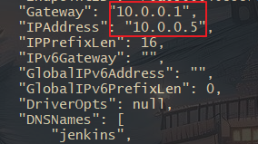
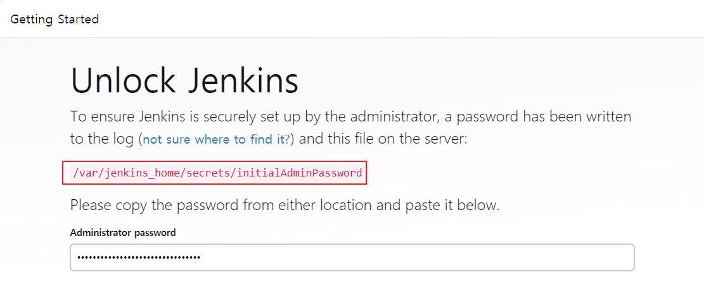

## Jenkins Declarative Pipeline Blue & Green 무중단 배포 구현

Nginx와 Docker를 이용해 Jenkins CI & CD를 구현하며, Jenkins는 Docker Container로 진행하고 

Ubuntu Server에 Docker가 설치된 상태라고 가정하고 글을 작성합니다.

<br>

### Docker Custom Bridge 생성

제 경우에는 각각의 인스턴스가 아닌 Active/StandBy 방식으로 컨테이너 끼리 Blue, Green 배포를 할것이고,

기본적으로 Docker의 기본 네트워크인 bridge0은 Container가 중지되고 재실행 될 때마다 IP가 유동적으로 바뀝니다.

그래서 저는 도커 네트워크를(Custom Bridge) 만들어 Container의 IP를 고정시켜서 변경되지 않게 합니다.

즉, 새로운 Docker Bridge를 만들고 컨테이너들을 기본 bridge0이 아닌 Custom Bridge에 할당시킵니다.

```bash
docker network create --gateway 10.0.0.1 --subnet 10.0.0.0/16 deploy
```

이 후, docker run을 할 때 --network deploy 옵션과 --ip 172.20.0.X 로 아이피를 할당하면 됩니다.

<br>

### Jenkins Container 실행

우선 Jenkins Container를 받아주고 위에서 만든 Private Docker Network에 넣어주고 IP는 5번을 할당합니다.

추후 Blue,Green Container에는 2번과 3번으로 할당 할 겁니다.

```bash
# 8080 : Jenkins Management Port
# 50000 : Jenkins Agent Port
docker run -d --name jenkins --restart=on-failure -p 9000:8080 -p 50000:50000 -v /home/skw/jenkins:/var/jenkins_home --network deploy --ip=10.0.0.5 jenkins/jenkins:lts
```

아래 이미지처럼 Container를 Inspect 한 결과 지정한 IP인 10.0.0.5가 할당되었습니다.



<br>

그리고, 실행된 컨테이너 내부에 초기 비밀번호 파일을 확인해서 로그인할 떄 사용해줍니다.

- `docker logs jenkins`를 입력하면 아래와 같이 초기 패스워드를 볼 수 있습니다.
- 이 초기패스워드로 로그인 후, Install Suggested Plugins을 클릭해 기본 플러그인들을 설치해줍니다.

```bash
docker logs jenkins
```

```
Jenkins initial setup is required. An admin user has been created and a password generated.
Please use the following password to proceed to installation:

6a65cf76fg7f4f16a6sc99cd4a110b0d

This may also be found at: /var/jenkins_home/secrets/initialAdminPassword
```



<br>

### SSH Key 생성 (in Container)

Jenkins Container 내부로 들어가서 SSH Key를 생성하고 CI & CD를 구축할 Github 계정에 등록해줍니다.

- Github 계정 설정 - SSH and GPG Key에 Public Key 등록

```bash
docker exec -it jenkins /bin/bash
cd && mkdir .ssh && cd .ssh && ssh-keygen -t rsa

cat id_rsa_pub # 키값 복사하기
```