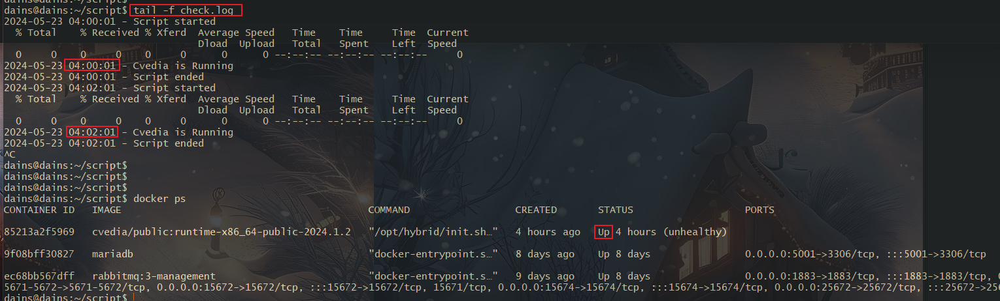
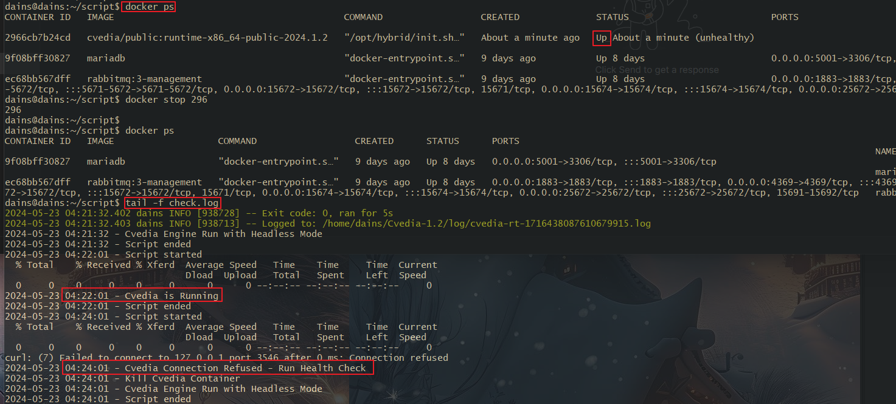

## CronTab 사용법

특정 IP:Port에 대한 HTTP Request가 Connection Refused가 뜰 때 프로세스를 Kill 하고 재기동 하는 Cron을 예시로 작성해 보겠습니다.

```bash
skw@skw:~$ curl -X GET http://localhost:3546/v1/core/instances
curl: (7) Failed to connect to localhost port 3546 after 0 ms: Connection refused
```

<br>

CronTab에 적용할 Shell Script를 먼저 작성해줍니다.

- 로그 파일의 크기를 50MB로 제한
- 50MB가 넘어갈 시 오래된 로그 삭제 및 새로운 로그로 대체
- 특정 API에 GET 요청을 보냈을 때 Connection Refused가 아니라면 "XX is Running" 출력
- 연결이 끊겼다면 Container를 중지하고 AI Model을 Headless로 재기동
- Cron 작업은 **사용자의 환경 변수를 상속받지 않기 때문에** PATH 변수 값을 포함해줍니다.

```bash
#!/bin/bash

# API 요청을 보낼 IP와 포트
IP="127.0.0.1"
PORT="3546"
LOG_FILE="/home/skw/logs/check.log"
MAX_LOG_SIZE=52428800  # 50MB

# 로그 파일 크기 관리 함수
manage_log_size() {
  if [ -f "$LOG_FILE" ]; then
    LOG_SIZE=$(stat -c%s "$LOG_FILE")
    if [ "$LOG_SIZE" -ge "$MAX_LOG_SIZE" ]; then
      mv "$LOG_FILE" "$LOG_FILE.bak"
      echo "Log file size exceeded, backing up and truncating." > "$LOG_FILE"
      tail -n 10000 "$LOG_FILE.bak" >> "$LOG_FILE"  # 마지막 10000줄만 유지
      rm "$LOG_FILE.bak"
    fi
  fi
}

# 환경변수 추가
export PATH=/usr/local/cuda-12.4/bin:/usr/local/sbin:/usr/local/bin:/usr/sbin:/usr/bin:/sbin:/bin:/usr/games:/usr/local/games:/snap/bin

# echo 명령어의 출력만 로그 파일로 기록
{
  echo "$(date '+%Y-%m-%d %H:%M:%S') - Script started"

  # curl 요청을 보내고 connection refused 확인
  curl -X GET http://$IP:$PORT/v1/core/instance -o /dev/null 2>&1
  CURL_EXIT_CODE=$?

  if [ $CURL_EXIT_CODE -eq 7 ]; then # connection refused 발생 시 실행할 명령어들
    echo "$(date '+%Y-%m-%d %H:%M:%S') - Cvedia Connection Refused - Run Health Check"

    # 이름에 'cvedia'가 포함된 Docker 컨테이너 중지
    docker ps | grep cvedia | awk '{print $1}' | xargs -I {} docker stop {}
    echo "$(date '+%Y-%m-%d %H:%M:%S') - Kill Cvedia Container"

    # 스크립트 실행
    cd /home/skw/Cvedia-1.2
    sudo ./run.sh -m --disable_mqtt -- --net=host
    echo "$(date '+%Y-%m-%d %H:%M:%S') - Cvedia Engine Run with Headless Mode"
  else
    echo "$(date '+%Y-%m-%d %H:%M:%S') - Cvedia is Running"
  fi

  # 로그 파일 크기 관리
  manage_log_size

  echo "$(date '+%Y-%m-%d %H:%M:%S') - Script ended"
} >> "$LOG_FILE"
```

<br>

스크립트를 전부 작성 후 `crontab -e`를 입력하여 cron을 작성 해줍니다.

- crontab -e 명령은 개인 사용자의 cron 설정합니다.
- 전역 시스템 cron은 `/etc/cron/crontab`을 사용하면 됩니다.

```bash
*/2 * * * * /home/skw/health-check.sh
```

<br>

Cron이 제대로 실행 중인지 확인 & 로그 파일 확인

```bash
# Cron 실행 확인
grep CRON /var/log/syslog

# 로그 파일 잘 쌓이는지 확인
tail -f /home/skw/script/check.log
```

<br>

아래 이미지를 보면 2분마다 cron 작업 잘 실행되고 있습니다.



<br>

Docker Containeer를 수동으로 중지하고 2분 후 cron이 Health Check를 수행해 다시 Docker Container를 올립니다.

