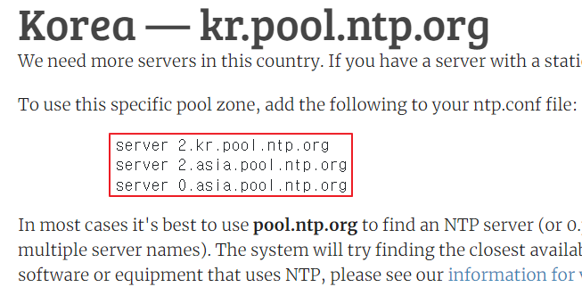
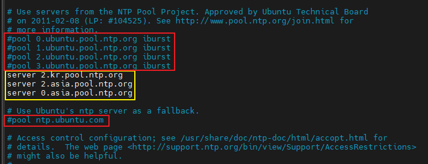
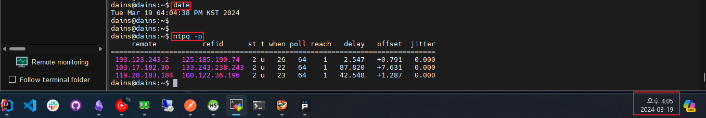

## NTP - 서버 시간 동기화

아래 URL에서 한국 시간대의 NTP 서버 3개 URL을 가져와 저장 해 둡니다.

[NTP Servers in Korea](https://www.ntppool.org/zone/kr)



<br>

**서버에서 NTP 서비스 설치**

```bash
sudo apt -y install ntp
```

<br>

그 후, `/etc/ntp.conf` 파일에서 아래 사진과 같이 빨간 박스 부분은 주석처리하고,

노란 박스 부분에 위 NTP 사이트에서 가져온 3개의 URL을 노란 박스처럼 넣어주고 저장합니다.



<br>

`/etc/ntp.conf` 파일 수정을 완료 했다면 서비스를 재시작 합니다.

재시작 후, `date` 명령과 `ntpq -p` 명령을 실행해 적용됬는지 확인 해보면 잘 적용되었습니다.

```bash
sudo systemctl restart ntp
sudo systemctl enable ntp
date
ntpq -p
```



<br>

- `remote` : sync 를 하는 straum 2 서버주소
- `refid` : 각 straum 2 서버가 현재 sync 를 하고 있는 straum 1 서버를 보여준다.
- `st` : 이 값이 16일 경우 해당 서버에 접속 할 수 없는 상태다.
- `delay` : 양수이며 최대한 작은게 좋은 서버


- `*`표시가 있는 것이 현재 NTP 데몬이 싱크를 하고 있는 서버
- `+`는 ntp 알고리즘에 의해 접속은 가능하지만 sync 를 하고 있지는 않음을 의미
- `-`는 ntp 알고리즘에 의해 접속은 가능하지만 sync 가능 리스트에서 제외
- 아무 기호 표시 없다면 접속이 불가능

---

## Docker Container & MariaDB 시간 동기화

**Docker Container 내부 시간 동기화**

```bash
dpkg-reconfigure tzdata
```

<br>

**MariaDB 시간 동기화**

```sql
SELECT @@global.time_zone, @@session.time_zone;


SET GLOBAL time_zone = 'Asia/Seoul';
SET SESSION time_zone = 'Asia/Seoul';
```